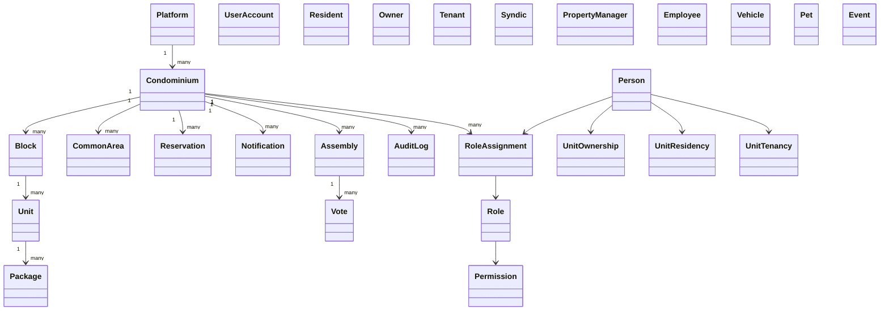
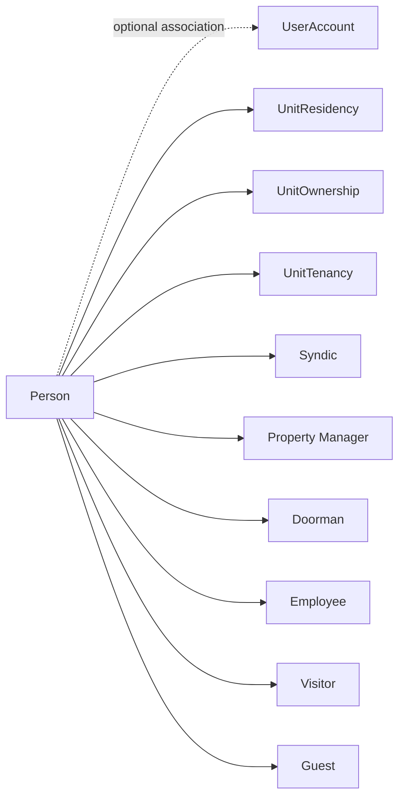

# DOMAIN.md

## Resumo executivo

O domínio do Condomínio é um ecossistema de gestão de propriedade horizontal em ambiente SaaS multi-tenant. A plataforma permite atender diversos condomínios simultaneamente, mantendo isolamento rigoroso por condomínio, unidade, usuário, papel e permissão.

O produto cobre desde a gestão de infraestrutura física e pessoas até processos operacionais como reservas, portaria, assembleias e notificações.

## Visão geral do domínio

## 1. Platform e multi-tenancy

### Platform

A Platform representa a operação SaaS como um todo. Ela agrega múltiplos condomínios e oferece uma camada de composição para regras compartilhadas, módulos opcionais e governação global.

### Condominium

O Condominium representa uma entidade jurídica ou operacional de condomínio específico. Cada condomínio tem seu próprio conjunto de blocos, unidades, áreas comuns, usuários, eventos, assembleias e registros de operação.

Regras de domínio:

- a plataforma pode atender múltiplos condomínios;
- o isolamento entre condomínios deve ser explícito e verificável em todas as operações;
- dados e acessos de um condomínio não podem ser herdados por outro sem autorização explícita;
- a mesma `Person` pode participar de mais de um condomínio com diferentes vínculos e `RoleAssignment`s; a associação e cardinalidade de `UserAccount` são decisões abertas.

## 2. Estrutura física

### Block

Representa um edifício, torre ou conjunto físico dentro de um condomínio.

Relacionado a:

- Condominium
- Unit
- CommonArea (quando houver localização compartilhada ou zonal)

### Unit

Uma unidade representa apartamento, casa, loja ou espaço residencial/comercial pertencente ao condomínio. É o principal ponto de associação entre pessoas, veículos, pets, encomendas e reservas.

Relações:

- Condominium
- Block
- Owner
- Resident
- Tenant
- UnitOwnership
- UnitResidency
- UnitTenancy
- Vehicle
- Pet
- Package
- Reservation
- Visit
- AccessAuthorization
- AccessEvent

### CommonArea

Uma área comum é espaço compartilhado do condomínio.

Exemplos:

- salão de festas;
- churrasqueira;
- espaço gourmet;
- quadra;
- piscina;
- academia;
- área de serviço compartilhada;
- salão de jogos;
- outros espaços de convivência.

Uma área comum pode:

- permitir reserva;
- possuir regras;
- possuir capacidade máxima;
- possuir horários de uso;
- exigir aprovação;
- exigir pagamento;
- exigir lista de convidados;
- exigir autorização de acesso específica.

Essas capacidades devem ser modeladas como configurações, não como regras universais.

## 3. Pessoas e usuários

### Person

Pessoa do domínio. Pode ter vínculos com unidades e participar de vários condomínios sem que seus dados operacionais sejam misturados.

### User / UserAccount

Conta de acesso associada a uma `Person`. `User` é o termo já usado no vocabulário; `UserAccount` explicita que se trata de conta e não de uma segunda pessoa. Uma Person pode existir sem conta. Cardinalidade, convite, ativação, suspensão e associação estão definidos como decisões abertas.

### Resident

Pessoa com vínculo `UnitResidency`; o termo pode ser utilizado como classificação ou papel contextual, mas não substitui o registro do vínculo.

### Owner

Pessoa com vínculo `UnitOwnership`. A propriedade não implica residência, conta ou papel administrativo.

### Tenant

Pessoa com vínculo `UnitTenancy`. Locação não implica propriedade nem, sem vínculo distinto, residência.

### Syndic

Representante do condomínio no papel de gestão administrativa e operacional. Pode ter papéis de gestão e aprovação em processos específicos.

### PropertyManager

Pessoa responsável pela administração operacional e por processos relacionados à gestão do condomínio ou de imóveis sob gestão.

### Doorman

Pessoa responsável pela portaria e controle de acesso.

### Employee

Funcionário do condomínio ou da operação terceirizada. Pode ter acesso funcional específico.

### Staff

Pessoa com vínculo operacional ou administrativo ao condomínio, em categoria mais ampla do que funcionário específico.

### Visitor

Classificação contextual de uma `Person` em uma visita; não é identidade independente.

### Guest

Classificação contextual de uma `Person` associada a evento ou visita; não implica autorização ou presença física.

### Observação sobre diferenciação

- `Person` = pessoa do domínio
- `User`/`UserAccount` = conta de acesso
- `UnitResidency` = vínculo residencial
- `UnitOwnership` = relação de propriedade
- `UnitTenancy` = relação de locação/ocupação
- `Syndic`, `PropertyManager`, `Doorman`, `Employee`, `Staff` = papéis operacionais e funcionais

Uma pessoa pode possuir diversos vínculos ao mesmo tempo e em diferentes unidades, condomínios e papéis. A relação pessoa-conta e sua cardinalidade ainda dependem de decisão.

## 4. Veículos

### Vehicle

Representa veículo associado a uma unidade ou a uma pessoa responsável.

Relacionamentos:

- Condominium
- Unit
- Person (responsável)
- UserAccount apenas para autoria/acesso quando aplicável

Campos conceituais:

- placa
- marca
- modelo
- cor
- tipo
- status

Status e regras de uso devem ser configurados conforme necessidade do condomínio; o modelo não deve presumir um padrão universal sem validação.

## 5. Pets

### Pet

Representa animal de estimação vinculado a uma unidade, a uma pessoa ou a um condomínio conforme regra local.

Relações:

- Condominium
- Unit
- User/Resident/Owner/Tenant

Conceitos relevantes:

- espécie
- nome
- raça
- padrão de identificação
- status
- regras de convivência

Qualquer política de pets, como limite de animais, estrita exigência de cadastro ou regras de áreas comuns, deve ser tratada como `OPEN DECISION` até validação do condomínio ou da legislação local.

## 6. Reservas e eventos

### Reservation

A reserva representa a utilização de uma área comum ou espaço compartilado por uma unidade, usuário ou evento específico.

Relacionamentos:

- Unit
- User
- CommonArea
- Event
- Guest

Fluxo conceitual:

1. Morador escolhe área comum.
2. Escolhe data e horário.
3. Sistema verifica disponibilidade.
4. Reserva é criada em estado adequado.
5. Participantes e convidados são registrados.
6. Autorização de acesso pode ser gerada quando aplicável.

### Event

Evento dentro do condomínio ou associado à área comum. Pode representar reunião, festa, comemoração, atividade ou uso específico de espaço.

Relacionamentos:

- Reservation
- Guest
- CommonArea
- Unit
- User

### AccessAuthorization

Permissão contextual e temporal para uma pessoa acessar o condomínio/unidade. Pode existir sem visita realizada e não comprova entrada.

Pode incluir:

- pessoa autorizada;
- unidade responsável;
- motivo;
- período de validade;
- evento relacionado;
- método de identificação;
- status.

### Visit e AccessEvent

`Visit` representa uma visita planejada ou registrada. `AccessEvent` representa fato observado de acesso, como `ENTRY`, `EXIT` ou `DENIED`. Autorização, visita e ocorrência real são conceitos distintos. Ver regras em [docs/business-rules/access.md](./docs/business-rules/access.md).

## 7. Portaria e acesso

### Visitor

Classificação contextual de uma `Person` em visita, não identidade independente.

### Guest

Classificação contextual de uma `Person` associada a evento/visita; não implica autorização nem presença física.

### Package

Encomenda que chega ao condomínio e precisa ser recebida e notificada.

### PackageEvent

Registro factual e histórico do ciclo operacional da encomenda, incluindo recebimento, notificação, confirmação, retirada e cancelamento. Não é entidade de entrega separada.

O destinatário é uma pessoa/unidade contextual. Notificações e confirmações mantêm seus próprios conceitos e referenciam o pacote.

Fluxo conceitual:

1. Encomenda chega na portaria.
2. Funcionário registra condomínio, unidade, destinatário, origem e descrição.
3. Sistema registra a encomenda.
4. Sistema resolve o destinatário conforme política do condomínio.
5. Sistema pode criar uma notificação e registrar tentativas de entrega.
6. Pessoa autorizada pode confirmar recebimento pelo mecanismo aprovado.
7. Portaria recebe/visualiza confirmação.
8. Eventos históricos permanecem; estado atual, se apresentado, segue política definida.

A comunicação pode ocorrer por canais como WhatsApp, push, e-mail ou in-app; o canal exato não deve ser definido como regra universal.

## 8. Notificações

### Notification

Representa mensagem ou comunicação dirigida a um destinatário.

Conceitos fundamentais:

- destinatário
- tipo
- conteúdo
- NotificationDelivery(s), com canais e status por tentativa
- data de criação
- data de leitura
- falha/evento de entrega

### NotificationDelivery

Tentativa e resultado de entrega por canal. Uma `Notification` pode ter múltiplos registros de entrega independentes, por exemplo Push, WhatsApp, E-mail ou In-app. O canal não implica provedor.

### WhatsAppMessage

Mensagem enviada por WhatsApp como canal de comunicação do condomínio.

Exemplos de uso:

- encomenda recebida;
- aviso de reserva;
- autorização de visitante;
- comunicados;
- notificações importantes.

A decisão sobre provedor, templates e opt-in deve ser documentada como `OPEN DECISION`.

## 9. Assembleias e votação

### Assembly

Assembleia do condomínio para deliberação, reunião ou votação.

Relacionamentos:

- Participant
- AgendaItem
- Vote
- Proxy
- Quorum

Campos conceituais:

- data
- horário
- local
- pauta
- participantes
- decisões
- votações

### VotingEligibility

Conceito que determina se uma pessoa pode votar em uma assembleia ou pauta específica.

Determina resposta à pergunta:

> Esta pessoa pode votar nesta assembleia nesta pauta?

### Proxy

Representação de outorgante por procurador em assembleia ou votação.

Campos conceituais:

- outorgante
- procurador
- validade
- escopo
- assembleia quando aplicável

### Vote

Voto em assembleia ou processo de decisão.

Possíveis estados conceituais:

- pending
- open
- closed
- cancelled

Possíveis opções conceituais:

- yes
- no
- abstain
- extensível por configuração

A regra jurídica sobre elegibilidade, quórum, voto secreto e aberta deve ser configurável e não tratada como regra universal.

## 10. Módulo financeiro (opcional)

O módulo financeiro é opcional e não deve ser obrigatório para todos os condomínios.

### FinancialModule

Conceitualização de ativação ou disponibilidade de funcionalidade financeira no condomínio.

Entidades relacionadas:

- FinancialAccount
- Income
- Expense
- Supplier
- Category
- FinancialDocument
- FinancialReport

O objetivo é permitir prestação de contas, mas o módulo não deve ser imposto como requisito de operação da plataforma.

## 11. Sistema de permissões e auditoria

### Role

Papel funcional de um usuário dentro da plataforma ou do condomínio.

### Permission

Autorização específica para executar uma ação ou visualizar um recurso.

### Scope

Escopo de aplicação de uma permissão ou papel.

Escopos conceituais:

- platform
- condominium
- block
- unit
- feature

### RoleAssignment

Atribuição de um papel a uma pessoa em escopo contextual. Uma atribuição em um condomínio não concede o mesmo papel em outro. Autoridade para conceder/revogar e herança de escopos seguem [PERMISSIONS.md](./PERMISSIONS.md) e decisões abertas.

### AuditLog

Registro de auditoria de ações sensíveis.

Campos conceituais:

- actor
- action
- resource
- date/time
- condominium
- result
- context

Ações sensíveis que devem ser registradas:

- alteração de morador
- alteração de proprietário
- reserva
- autorização de visitante
- recebimento de encomenda
- confirmação de encomenda
- alteração de permissões
- votação
- alteração financeira

## 12. Identidade, conta e sessão

Conceitos de domínio:

- Person
- User / UserAccount
- Identity
- Authentication
- Session
- Role
- RoleAssignment
- Permission

Esses conceitos pertencem ao domínio funcional. Tecnologias específicas de autenticação (JWT, OAuth, Keycloak, Cognito, Auth0 etc.) devem ser tratadas como decisões técnicas da API e não como regra de domínio.

## 13. Estados e convenções

Estados devem ser documentados com:

- significado;
- transições permitidas;
- quem pode disparar a transição;
- efeito da transição.

Exemplos de convenção:

- Reservation: draft, pending, confirmed, cancelled, completed, expired
- PackageEvent: RECEIVED, NOTIFIED, CONFIRMED, PICKED_UP, CANCELLED (fatos, não estados)
- AccessAuthorization: draft, active, expired, revoked, cancelled (vocabulário candidato)

Estados e transições acima não são todos regras aprovadas. `ENTRY`, `EXIT`, `DENIED` e eventos do pacote são fatos, não estados. Ver [BUSINESS-RULES.md](./BUSINESS-RULES.md) para regras e decisões pendentes.

## 14. Dados pessoais, consentimento e retenção

O produto deve registrar e respeitar conceitos de:

- dados pessoais;
- dados de acesso;
- logs;
- retenção;
- consentimento quando aplicável;
- finalidade;
- minimização de dados;
- auditoria.

Esses tópicos devem ser documentados como requisitos de produto e cuidadosamente validados juridicamente posteriormente.

## 15. Modelagem comercial

### Subscription

Conceito de assinatura do condomínio ou da plataforma.

### Plan

Plano comercial oferecido ao cliente.

### Feature

Funcionalidade habilitada no contexto de um condomínio.

### Module

Módulo funcional de produto que pode ser ativado ou não.

Esses conceitos são relevantes para produto e comercialização, mas não devem ser implementados como cobrança nesta etapa.

## 16. Regras críticas de domínio

- O sistema deve suportar vários condomínios em uma mesma plataforma.
- Usuários de um condomínio não devem acessar dados de outro sem autorização explícita.
- O papel e a permissão devem determinar acessos.
- A pessoa pode ter múltiplos papéis e vínculos em diferentes contextos.
- Não se deve assumir que todos os condomínios usam os mesmos papéis, regras ou módulos.
- O módulo financeiro é opcional e deve ser ativado por configuração.
- A documentação deve registrar e separar regras comprovadas, configuráveis e pendentes.

## 17. Documentos relacionados

- [README.md](./README.md)
- [BUSINESS-RULES.md](./BUSINESS-RULES.md)
- [PERMISSIONS.md](./PERMISSIONS.md)
- [WORKFLOWS.md](./WORKFLOWS.md)
- [OPEN-DECISIONS.md](./OPEN-DECISIONS.md)
- [docs/README.md](./docs/README.md)

## Status

Domínio conceitual estabelecido e documentado como base para desenvolvimento posterior.
