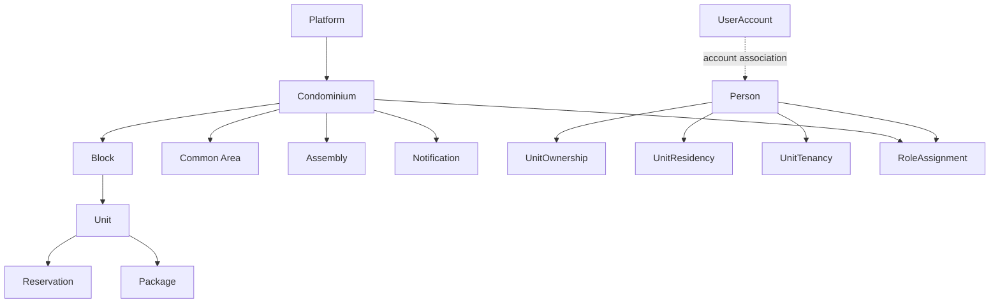

# Condomínio Context

Este repositório é a fonte documental do produto Condomínio e representa a modelagem de domínio antes da implementação técnica.

Objetivo principal:

- definir entidades, relacionamentos e papéis do negócio;
- registrar regras de negócio e acordos de domínio;
- manter multi-tenancy e isolamento entre condomínios explícitos;
- documentar workflows, estados, permissões e decisões pendentes;
- servir de base para os repositórios `condominio-api`, `condominio-admin` e `condominio-mobile`.

## Status

`ARCHITECTURE_REQUIRES_REVISION`

## Estrutura

```text
condominio-context/
├── README.md
├── AGENTS.md
├── DOMAIN.md
├── BUSINESS-RULES.md
├── PERMISSIONS.md
├── WORKFLOWS.md
├── API-CONTRACT.md
├── ARCHITECTURE-CRITICAL-REVIEW.md
├── OPEN-DECISIONS.md
├── docs/
│   ├── architecture/
│   │   ├── overview.md
│   │   ├── layers.md
│   │   ├── dependencies.md
│   │   ├── modules.md
│   │   ├── application.md
│   │   ├── domain.md
│   │   ├── authorization.md
│   │   ├── tenant-context.md
│   │   ├── transactions.md
│   │   ├── events.md
│   │   ├── outbox.md
│   │   ├── infrastructure.md
│   │   ├── observability.md
│   │   ├── project-structure.md
│   │   └── decisions.md
│   ├── domain/
│   │   ├── overview.md
│   │   ├── condominiums.md
│   │   ├── people.md
│   │   └── operations.md
│   ├── business-rules/
│   │   ├── multi-tenancy.md
│   │   ├── access-and-authorization.md
│   │   ├── tenancy.md
│   │   ├── identity.md
│   │   ├── units.md
│   │   ├── permissions.md
│   │   ├── access.md
│   │   ├── reservations.md
│   │   ├── packages.md
│   │   ├── notifications.md
│   │   ├── assemblies.md
│   │   ├── modules.md
│   │   ├── audit.md
│   │   └── privacy.md
│   ├── permissions/
│   │   ├── roles-and-permissions.md
│   │   ├── authorization-model.md
│   │   ├── roles.md
│   │   ├── permissions.md
│   │   ├── scopes.md
│   │   ├── role-assignment.md
│   │   ├── data-visibility.md
│   │   └── permission-matrix.md
│   ├── workflows/
│   │   ├── primary-flows.md
│   │   ├── onboarding.md
│   │   ├── identity-and-units.md
│   │   ├── roles.md
│   │   ├── reservations-events.md
│   │   ├── access.md
│   │   ├── packages-notifications.md
│   │   ├── assemblies.md
│   │   ├── modules-finance.md
│   │   └── audit-corrections.md
│   ├── state-machines/
│   │   ├── README.md
│   │   ├── identity-and-reservations.md
│   │   ├── access-and-packages.md
│   │   ├── communications-and-assemblies.md
│   │   └── modules.md
│   ├── api/
│   │   ├── overview.md
│   │   ├── resources.md
│   │   ├── commands.md
│   │   ├── queries.md
│   │   ├── authorization.md
│   │   ├── errors.md
│   │   ├── idempotency.md
│   │   ├── traceability.md
│   │   └── versioning.md
│   ├── notifications/
│   │   └── channels.md
│   ├── decisions/
│   │   └── decisions-log.md
│   └── README.md
├── .github/
│   └── workflows/
│       └── .gitkeep
└── .gitignore
```

## Visão de domínio



## Entidades principais

- Platform
- Condominium
- Block
- Unit
- CommonArea
- Person
- User
- UserAccount
- UnitOwnership
- UnitResidency
- UnitTenancy
- Role
- RoleAssignment
- Permission
- Scope
- Vehicle
- Pet
- Reservation
- Event
- Visit
- AccessAuthorization
- AccessEvent
- Package
- PackageEvent
- Notification
- NotificationDelivery
- Assembly
- Participant
- AgendaItem
- VotingEligibility
- Vote
- Proxy
- Quorum
- Module
- Feature
- CondominiumModule
- CondominiumFeature
- AuditLog

## Regras de referência

- O sistema é SaaS e deve suportar múltiplos condomínios dentro da mesma plataforma.
- Isolamento entre condomínios é obrigatório e deve ser explicitamente documentado.
- Usuário não é sinônimo de morador; a pessoa pode ter múltiplos vínculos e papéis.
- Papel e permissão são conceitos distintos.
- Qualquer regra jurídica ou de negócio ainda não definida deve constar como `OPEN DECISION`.
- Nenhuma implementação técnica deve ser adicionada neste repositório.

## Documentação principal

- [DOMAIN.md](./DOMAIN.md)
- [BUSINESS-RULES.md](./BUSINESS-RULES.md)
- [PERMISSIONS.md](./PERMISSIONS.md)
- [docs/permissions/](./docs/permissions/)
- [WORKFLOWS.md](./WORKFLOWS.md)
- [State machines e ciclos de vida](./docs/state-machines/README.md)
- [API Contract conceitual](./API-CONTRACT.md)
- [Arquitetura conceitual do backend](./docs/architecture/overview.md)
- [Revisão crítica da arquitetura](./ARCHITECTURE-CRITICAL-REVIEW.md)
- [OPEN-DECISIONS.md](./OPEN-DECISIONS.md)
- [Regras de negócio detalhadas](./docs/business-rules/)
- [docs/README.md](./docs/README.md)

## Observações

Este repositório é predominantemente documental. A criação de API, banco de dados, SQL, migrations, endpoints, frontend ou mobile é proibida nesta etapa.
