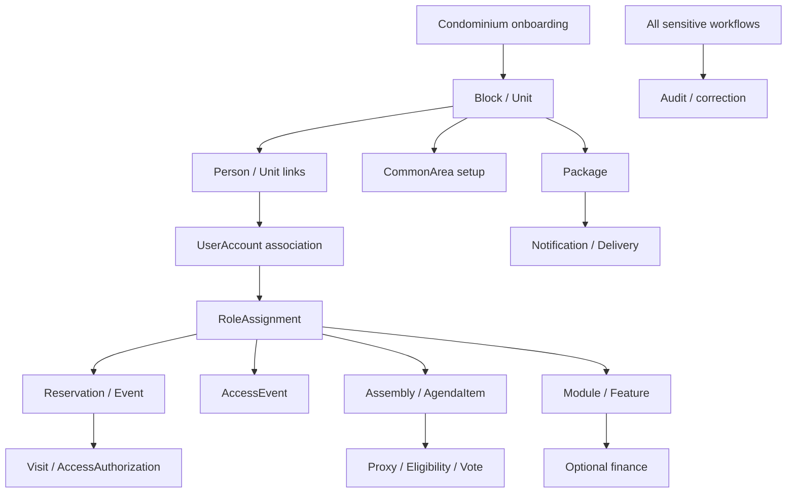

# WORKFLOWS.md

## Objetivo e convenções

Catálogo e índice dos workflows operacionais do produto. Os fluxos conectam conceitos de domínio, regras de negócio, autorização, estado, fatos/eventos, notificações e auditoria. Eles não definem API, armazenamento, tecnologia, provedor, filas ou sequência técnica de execução.

Todo ator listado é participante potencial, não grant automático. A ação exige sujeito autenticado quando aplicável, `RoleAssignment`, `Permission`, `Scope`, tenant e condições de negócio coerentes. Use os detalhes em [PERMISSIONS.md](./PERMISSIONS.md) e sua matriz como baseline **proposta**, não concessão aprovada.

Estados e transições marcados como candidatos dependem das políticas aprovadas em [BUSINESS-RULES.md](./BUSINESS-RULES.md). Uma falha de notificação não reverte o fato de negócio que originou a comunicação. Correção deve preservar o histórico; não é permitido reescrever silenciosamente eventos.

## Catálogo

| ID | Workflow | Classificação | Documento |
|---|---|---|---|
| WF-01 | Onboarding de condomínio | CORE / ADMINISTRATIVE | [onboarding.md](./docs/workflows/onboarding.md) |
| WF-02 | Cadastro de bloco | CORE / ADMINISTRATIVE | [identity-and-units.md](./docs/workflows/identity-and-units.md) |
| WF-03 | Cadastro de unidade | CORE / ADMINISTRATIVE | [identity-and-units.md](./docs/workflows/identity-and-units.md) |
| WF-04 | Cadastro e associação de Person | CORE / ADMINISTRATIVE | [identity-and-units.md](./docs/workflows/identity-and-units.md) |
| WF-05 | Convite/criação/ativação de UserAccount | CORE / ADMINISTRATIVE | [identity-and-units.md](./docs/workflows/identity-and-units.md) |
| WF-06 | UnitOwnership | CORE / ADMINISTRATIVE | [identity-and-units.md](./docs/workflows/identity-and-units.md) |
| WF-07 | UnitResidency | CORE / ADMINISTRATIVE | [identity-and-units.md](./docs/workflows/identity-and-units.md) |
| WF-08 | UnitTenancy | CORE / ADMINISTRATIVE | [identity-and-units.md](./docs/workflows/identity-and-units.md) |
| WF-09 | RoleAssignment grant/revoke/suspend/expire | CORE / ADMINISTRATIVE | [roles.md](./docs/workflows/roles.md) |
| WF-10 | Vehicle | CORE / OPERATIONAL | [identity-and-units.md](./docs/workflows/identity-and-units.md) |
| WF-11 | Pet | CORE / ADMINISTRATIVE | [identity-and-units.md](./docs/workflows/identity-and-units.md) |
| WF-12 | CommonArea setup/block/maintenance | CORE / ADMINISTRATIVE | [reservations-events.md](./docs/workflows/reservations-events.md) |
| WF-13 | Reservation | CORE | [reservations-events.md](./docs/workflows/reservations-events.md) |
| WF-14 | Event and invited persons | CORE / OPERATIONAL | [reservations-events.md](./docs/workflows/reservations-events.md) |
| WF-15 | Visit | CORE / OPERATIONAL | [access.md](./docs/workflows/access.md) |
| WF-16 | AccessAuthorization | CORE / OPERATIONAL | [access.md](./docs/workflows/access.md) |
| WF-17 | AccessEvent ENTRY/EXIT/DENIED | CORE / OPERATIONAL | [access.md](./docs/workflows/access.md) |
| WF-18 | Package receipt and custody | CORE / OPERATIONAL | [packages-notifications.md](./docs/workflows/packages-notifications.md) |
| WF-19 | Package confirmation and release | CORE / OPERATIONAL | [packages-notifications.md](./docs/workflows/packages-notifications.md) |
| WF-20 | Notification and NotificationDelivery | CORE / OPERATIONAL | [packages-notifications.md](./docs/workflows/packages-notifications.md) |
| WF-21 | Assembly, participants, agenda, presence, eligibility, vote and results | CORE / CONFIGURABLE + LEGAL | [assemblies.md](./docs/workflows/assemblies.md) |
| WF-22 | Proxy creation/validation/use/revocation | CORE / CONFIGURABLE + LEGAL | [assemblies.md](./docs/workflows/assemblies.md) |
| WF-23 | Module/Feature enablement | ADMINISTRATIVE / CONFIGURATION | [modules-finance.md](./docs/workflows/modules-finance.md) |
| WF-24 | Finance income, expense and accountability | OPTIONAL MODULE | [modules-finance.md](./docs/workflows/modules-finance.md) |
| WF-25 | Cross-cutting audit and correction | CROSS-CUTTING | [audit-corrections.md](./docs/workflows/audit-corrections.md) |
| WF-26 | Cross-tenant wrong-context attempt | CROSS-CUTTING / SECURITY | [audit-corrections.md](./docs/workflows/audit-corrections.md) |

## Dependências principais

## Padrão transversal de falha e encerramento

- Negar sem revelar dados de outro tenant quando sujeito, permissão, scope ou contexto não correspondem.
- Recurso inexistente, estado incompatível, validade expirada, módulo desabilitado ou regra local não satisfeita impedem a transição solicitada; fatos anteriores permanecem.
- Conflito de agenda/concorrência não deve resultar em duas confirmações incompatíveis quando a política proíbe sobreposição.
- Falha em canal de NotificationDelivery não desfaz reserva, recebimento de pacote, autorização, presença ou outro fato de negócio.
- Repetição de operação pode ser rejeitada ou reconhecida como repetição somente conforme regra definida; não criar fato duplicado nem substituir evidência anterior.
- Cada workflow termina quando a pós-condição de negócio é alcançada ou quando a operação é negada/cancelada, mantendo estado e histórico compatíveis com os fatos conhecidos.

## OPEN DECISIONS

Os fluxos abaixo dependem de decisões já registradas em [OPEN-DECISIONS.md](./OPEN-DECISIONS.md), especialmente: autoridade inicial de condomínio; identidade/convite; autoridade de grants; sobreposição de vínculos; política de reserva e concorrência; emissão/revogação de acesso; identificação e contestação de pacote; retry/fallback de notificação; legalidade de voto e procuração; grants de módulos; correção de fatos e semântica de repetição (OD-18).

## Documentos relacionados

- [BUSINESS-RULES.md](./BUSINESS-RULES.md)
- [PERMISSIONS.md](./PERMISSIONS.md)
- [DOMAIN.md](./DOMAIN.md)
- [OPEN-DECISIONS.md](./OPEN-DECISIONS.md)
