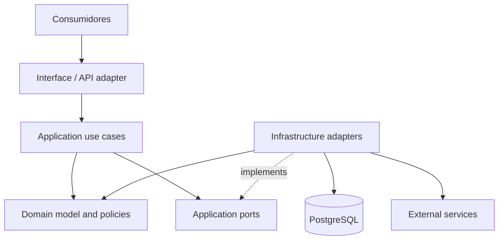
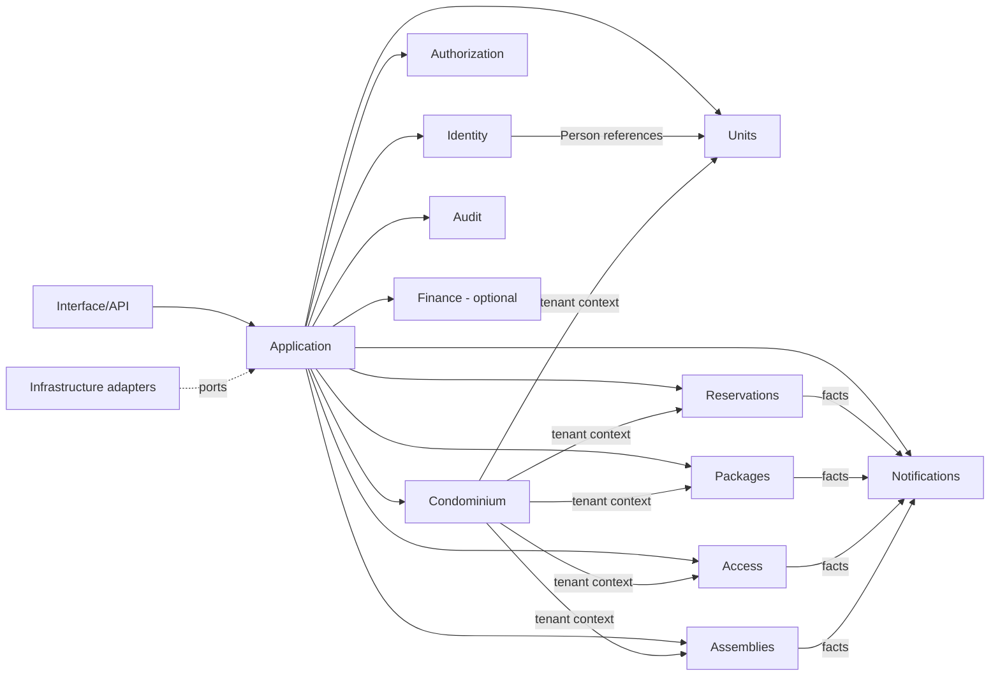

# Grafo de dependências

## Direção

Setas contínuas mostram chamada/direção conceitual. Infrastructure implementa portas definidas para atender necessidades de Application; o Domain não chama Infrastructure. A relação `Infra → Domain` existe para persistir/reconstituir conceitos e não permite que o domínio importe GORM ou tipos de banco.

## Regras anti-ciclo

- Domain não importa Application, Interface nem Infrastructure.
- Application pode orquestrar mais de um módulo, mas não depende de um adaptador concreto.
- Interface chama casos de uso; não chama repositório nem Aggregate diretamente para contornar guardas.
- Um módulo de domínio não deve depender do serviço HTTP ou do repositório concreto de outro módulo.
- Referências entre módulos usam conceitos/identificadores e contratos estáveis; coordenação entre módulos fica na camada Application.
- Eventos de domínio conectam reações sem criar dependência de retorno entre módulos.
- Um módulo transversal de autorização não precisa carregar todos os agregados: recebe uma descrição contextual do recurso e valida tenant/scope através de fronteiras de aplicação.

## Grafo conceitual da aplicação

O desenho representa contextos de negócio e coordenação, não acoplamento obrigatório de pacotes ou chamada síncrona. Dependências específicas devem ser confirmadas ao detalhar os workflows; não se presume que cada seta represente import direto entre módulos.

## Caminho proibido

`Gin → GORM → Domain`, `Domain → PostgreSQL`, `Application → Gin` e `Domain → provider` violam a direção proposta. Consultar [layers](./layers.md) e [módulos](./modules.md).
