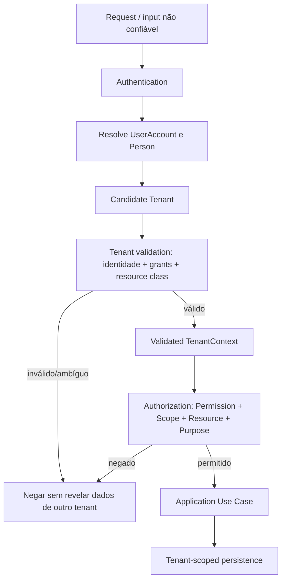
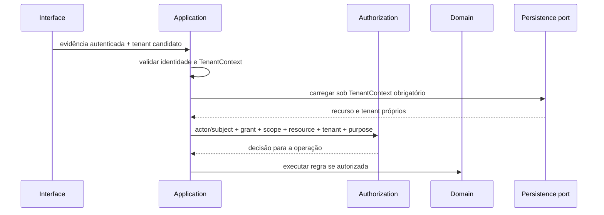

# TenantContext

## Conceito

`TenantContext` é o contexto validado de execução de um caso de uso tenant-scoped. `tenant_id` não é filtro opcional: é parte da fronteira de segurança e da chave de toda operação de persistência que possa ler ou alterar dados do tenant. Contexto ausente, inválido ou ambíguo impede a operação.

O contexto separa, sem colapsar, os seguintes conceitos:

| Elemento | Origem/confiabilidade | Significado e limite |
|---|---|---|
| Authentication evidence | Entrada validada pelo mecanismo futuro. | Prova de identidade técnica segundo política; não é permission nem tenant. |
| `UserAccount` | Resolvida da identidade autenticada. | Identidade de acesso; nunca é `Person` por equivalência presumida. |
| `Person` | Associação de domínio resolvida segundo OD-03. | Ator humano de negócio ou pessoa afetada; pode existir sem conta e participar de vários condomínios. |
| Candidate tenant | Valor indicado pela requisição/evento/trabalho. | Não confiável até validação; não pode selecionar diretamente dados. |
| Validated tenant | Tenant resolvido e validado no caso de uso. | Um único Condominium para operação tenant-scoped; `Platform` para operação global explicitamente classificada. |
| RoleAssignments | Grants carregados sob o sujeito e tenant/contexto. | Apenas candidatos; devem estar vigentes e ser validados para a ação. |
| Scope | Limite declarado de cada grant. | Não substitui tenant nem localização do recurso; cobertura descendente requer definição explícita. |
| Permissions | Capabilities aplicáveis aprovadas. | Catálogo/matriz proposta não concede por si só autoridade. Ausência de capability aprovada significa não expor a operação. |
| Purpose | Finalidade da operação, originada do caso de uso e não livremente ampliada pelo cliente. | Restringe uso/divulgação; não é autorização por si só. |
| Actor | Humano, processo de sistema ou serviço identificado separadamente. | Informa autoria; não é pessoa afetada nem necessariamente subject autenticado humano. |
| Correlation ID | Gerado/validado para correlacionar uma cadeia de execução. | Correlação apenas; nunca autentica, autoriza nem seleciona tenant. |
| Resource | Carregado com seu tenant e relações relevantes. | Existência/ID não prova pertencimento nem autorização. |

`TenantContext` só contém o mínimo necessário; não é token técnico, claim autoautorizado, identidade persistida nem permissão reutilizável entre operações.

## Origem e percurso

1. Request é tratada como entrada não confiável.
2. Authentication valida a evidência e resolve `UserAccount`; isso não decide autorização.
3. Identity resolve a associação a `Person` conforme OD-03; associação ou conta ausente não pode ser presumida.
4. Tenant recebido torna-se `Candidate Tenant`, nunca alvo de banco por si só.
5. Application valida o candidato contra identidade, grants aplicáveis e classe do recurso; operações Platform-scoped seguem caminho global explicitamente classificado.
6. Só então cria-se o `Validated TenantContext` com tenant único, actor, purpose, scope, permissions candidatas e correlation.
7. Authorization valida subject, operação, grants, Permission, Scope, Resource e condições adicionais.
8. Application Use Case executa regra/transição do Domain após autorização.
9. Tenant-scoped persistence recebe contexto/garantia tenant obrigatória em toda leitura e escrita.

Fluxo proibido: `Request → tenant_id do cliente → Database`.

Diagramas conceituais; não prescrevem middleware, protocolo, claims, assinatura literal de repository ou ordem física de consultas.

## Tenant scope em cada fronteira

| Camada / dado | Onde o tenant é conhecido | Valida/transmite | Não pode alterar | Execução sem tenant |
|---|---|---|---|---|
| API | Recebe candidate tenant e identidade autenticável. | Não autentica por ID; encaminha candidato e evidência à Application. | Não transforma candidate em tenant validado nem escolhe outro por fallback. | Só operação classificada Platform-scoped. |
| Application | Constrói TenantContext validado para cada chamada. | Valida identidade, grants, alvo e coerência; transmite contexto imutável ao caso de uso/ports. | Não aceita request/job como autoridade para trocar tenant após validação. | Operações globais enumeradas, não consultas ambíguas. |
| Domain | Recebe tenant/contexto como dado necessário para invariantes multi-tenant. | Confirma coerência de tenant entre entidades/referências quando aplicável. | Não resolve tenant consultando infraestrutura nem amplia scope. | Conceitos puros sem persistência/contexto operacional; nunca para ação tenant-scoped sem contexto. |
| Repository/Query port | Recebe validated TenantContext ou garantia equivalente explícita. | Restringe busca, mutação, join, paginação e agregação ao tenant antes de retornar dados. | Não omite tenant, não faz fallback global nem aceita ID como membership. | Apenas operação Platform-scoped/global declarada separadamente. |
| Infrastructure/persistence | Recebe contexto no contrato de operação. | Impõe filtro/ownership nas leituras e escritas e valida referências cross-tenant. | Não remove contexto nem interpreta conexão compartilhada como autorização. | Dados globais de Platform e catálogo explicitamente tipados; mecanismo adicional permanece aberto. |
| AuditLog | Captura tenant do contexto validado ou marca operação Platform-scoped. | Application inclui tenant/resource/actor/purpose; leitura exige filtro próprio. | Não infere tenant de payload nem combina tenants em query tenant-scoped. | Eventos globais de plataforma identificados como tais; não audit tenant sem contexto. |
| Domain/Operational Events | Tenant do fato de origem e classificação Platform/Tenant. | Application carrega tenant, origem e correlation ao encaminhar; consumidores revalidam. | Consumer não reclassifica um fato de tenant como global. | Evento global explicitamente tipado e autorizado. |
| Outbox/Notifications | Herdam tenant e origem da intenção validada. | Producer grava envelope mínimo; consumer valida envelope e Notification/Delivery. | Provider/consumer não altera tenant nem amplia audiência. | Notificação global de plataforma explicitamente classificada. |
| Jobs/scheduled actions | Cada tarefa contém candidate tenant/origem/purpose/actor. | Dispatcher/Use Case valida contexto no momento de executar. | Não herda tenant de request anterior nem usa `system` como bypass. | Somente job global com operação Platform-scoped explícita. |
| Cache/Search/reports | Chave/consulta precisa distinguir Platform de tenant e tenant individual. | Application aplica filtro antes de cache, busca, paginação, agregação ou export. | Não compartilhar resultado tenant-scoped nem remover filtro em relatório. | Catálogo agregado global aprovado e não identificável; análise específica obrigatória. |
| Logs/Metrics/Tracing | Contexto técnico recebe tenant validado apenas se necessário. | Instrumentação propaga correlation; minimiza tenant/PII em labels e payloads. | Não usa tenant/correlation como credencial nem mistura traces como prova de autorização. | Telemetria técnica global sem conteúdo/PII/tenant detalhado por padrão. |

### Classes de tenancy

- **PLATFORM-SCOPED:** catálogo global de Module/Feature/Role/Permission, gestão SaaS e operações globais explicitamente autorizadas. `UserAccount` pode ser identidade global conforme OD-03; sua classificação/associação não concede visibilidade a dados de condomínios.
- **TENANT-SCOPED:** Condominium, Block, Unit, relações operacionais no condomínio, Reservation, AccessAuthorization/Event, Package/Event, Assembly, Notification e AuditLog do tenant.
- **Person:** identidade pode ser compartilhada entre tenants; relações, papéis, propósito e visibilidade de dados continuam delimitados por tenant. Uma consulta global de Person exige finalidade/authority próprios e não combina históricos operacionais.

Toda classe de recurso deve ser declarada antes de ser persistida/exposta. Ausência de classificação não autoriza acesso global.

## Persistência fail-closed

- `tenant_id`/garantia equivalente é parte obrigatória do contrato de cada operação tenant-scoped, não argumento opcional.
- A forma conceitual de `FindByID` precisa receber TenantContext/tenant validado, ou ser limitada por uma garantia equivalente impossível de omitir acidentalmente.
- APIs unscoped são proibidas para recursos tenant-scoped; exceções globais têm classificação, propósito, permission e auditoria explícitos.
- IDs não indicam tenant; cada referência e join precisa ser validado para o mesmo tenant antes de uso.
- Filtro é aplicado antes de paginação, agregação, cálculo, cache e exportação.
- Infraestrutura pode adicionar defesa em profundidade; RLS/schema/particionamento não estão escolhidos e não substituem autorização da Application.
- Testes futuros devem provar negação de ID de B sob contexto A, alternância A/B e coerência de referências, queries, jobs e relatórios.

## Acesso cross-tenant e resposta

`resource existence ≠ resource authorization`; `resource ID ≠ tenant membership`. Um ID válido em outro Condominium jamais autoriza leitura/mutação.

Internamente a divergência pode ser classificada como `TENANT_MISMATCH` para audit/diagnóstico autorizado. Externamente, não confirmar existência nem conteúdo: resposta indistinguível de recurso não encontrado/não visível é a recomendação conservadora. Se expor `TENANT_MISMATCH` for necessário para produto, exige decisão explícita de segurança/privacy; status HTTP permanece fora de escopo.
