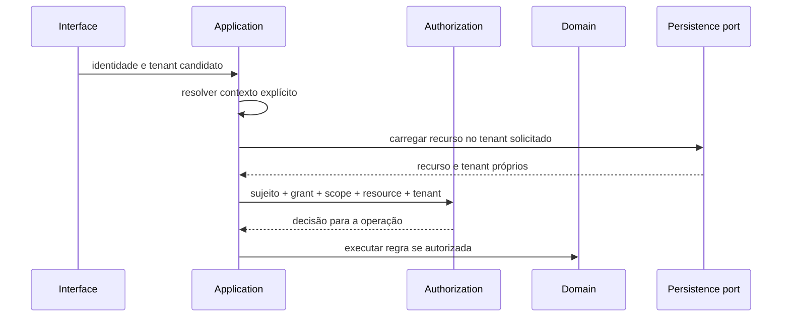

# TenantContext

## Conceito

`TenantContext` é o contexto de execução conceitual de um caso de uso. Agrupa evidências necessárias a interpretar o ator e o alvo sem substituir autorização ou localização real dos recursos.

Elementos relevantes, conforme operação:

- contexto `Platform` ou `Condominium` explícito;
- `UserAccount` autenticada e estado validado, quando houver ator autenticado;
- `Person` associada e identidade/autoridade do ator operacional, quando aplicável;
- RoleAssignments candidatos, permissions e scopes que ainda precisam de decisão;
- finalidade, tipo de operação e identificador de correlação;
- eventualmente o recurso alvo e seus vínculos de tenant, carregados para verificação.

O contexto só contém os dados mínimos para o caso de uso. Não é um token técnico, claim autoautorizado ou entidade persistida.

## Origem e percurso

1. Interface autentica as credenciais por mecanismo ainda não decidido e trata qualquer tenant recebido como candidato não confiável.
2. Application valida identidade/estado e resolve um único tenant alvo. Não infere tenant só a partir de Person, Unit, Block ou papel.
3. O recurso é carregado sob alvo explícito; Application compara tenant do resource, referências e scope.
4. A decisão de autorização é feita para aquela operação e resource.
5. O contexto validado acompanha o caso de uso até Domain e portas de persistência/auditoria necessárias.
6. Ao encerrar a operação, o contexto não se torna contexto global para outra requisição.

O diagrama é conceitual; não prescreve middleware, protocolo, claims, implementação de repository ou ordem física de consultas.

## Isolamento e processos sem usuário

- Toda relação operacional é confirmada dentro de um único tenant.
- Person presente em vários condomínios não funde seus dados, assignments, vínculos ou históricos.
- Operação cross-tenant requer autorização explicitamente aprovada, propósito e auditoria; sem estes, negar.
- Tarefas agendadas e handlers de evento não herdam a identidade de uma requisição antiga. Actor/process context, finalidade, tenant e autoridade de automação exigem atribuição explícita; não presumir `system` como bypass.
- Identificadores/correlation IDs nunca autorizam nem selecionam por si mesmos um tenant.

## Contexto e persistência

TenantContext não substitui a verificação de ownership de recurso e não garante isolamento se passado como mero filtro opcional. Application inclui o tenant em cada operação de leitura/escrita tenant-scoped; Infrastructure pode aplicar proteção adicional quando escolhida, mas nenhum mecanismo de banco (inclusive RLS) está decidido.

Cache, tarefas e chamadas externas também devem preservar tenant/finalidade e não compartilhar resposta entre tenants.
