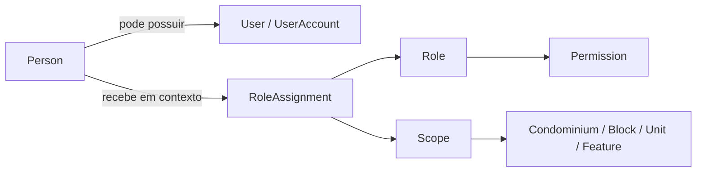
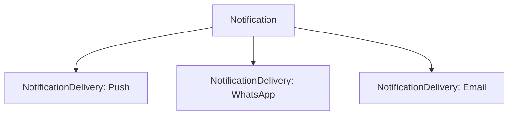

# Modelo estrutural do domínio

## 1. Objetivo e princípios

Este modelo fecha os principais conceitos estruturais antes da definição de soluções técnicas. É documentação de produto e domínio, não especificação de persistência ou implementação.

- A plataforma atende vários condomínios; dados e relações pertencem a um contexto tenant explícito.
- Identidade civil, conta de acesso, papel e permissão são conceitos distintos.
- Vínculos com unidades são tipados e não inferidos a partir da conta de acesso.
- Visitante é uma pessoa em um contexto de visita; autorização não prova que houve entrada.
- Registros de acesso e do ciclo de encomendas preservam fatos operacionais.
- Regras jurídicas e políticas locais não definidas permanecem como `OPEN DECISION`.

## 2. Modelo de identidade e autorização

### Person

Pessoa do mundo do domínio. Pode participar de um ou mais condomínios e ter vínculos com uma ou mais unidades. Uma `Person` pode ser proprietária, residente, locatária, representante, funcionária, visitante ou convidada em contextos diferentes. Essas designações não são identidades digitais.

### User / UserAccount

Conta que permite a uma pessoa autenticar-se e usar o produto. `User` é o termo existente no vocabulário; `UserAccount` torna explícita a natureza de credencial/acesso. O modelo conceitual trata `User` e `UserAccount` como o mesmo conceito, não como duas pessoas ou entidades de negócio independentes. Uma conta pode estar associada a uma `Person`; nem toda pessoa precisa ter conta.

Autenticação, credenciais, sessões e federação de identidade são conceitos funcionais, mas tecnologia e política permanecem fora do escopo deste modelo.

### Role

Papel nomeado, como `syndic`, que agrupa responsabilidades possíveis. Um papel, por si só, não identifica a pessoa que o exerce nem concede acesso fora do contexto de sua atribuição.

### RoleAssignment

Atribuição contextual de um `Role` a uma `Person` (e, quando necessário para acesso, à conta associada), com escopo explícito. O escopo pode ser platform, condominium, block, unit ou feature. A mesma pessoa pode ter papéis diferentes em condomínios distintos. Vigência, concessor, revogação e possibilidade de atribuir papel sem conta ainda requerem política definida.

### Permission e Scope

`Permission` é a capacidade específica de realizar uma ação sobre um recurso. `Scope` é o contexto em que a permissão ou `RoleAssignment` se aplica. A relação papel-permissão e as regras de composição, herança, precedência e negação precisam de governança explícita; não se presume acesso implícito entre condomínios.

## 3. Condomínio e unidades

- `Platform` agrega vários `Condominium`.
- `Condominium` delimita o tenant operacional e contém sua estrutura e relações locais.
- `Block` pertence a um `Condominium`.
- `Unit` pertence a um `Condominium` e pode estar organizada em um `Block`; a existência de unidades sem bloco deve ser decidida.
- `CommonArea` pertence ao contexto de um `Condominium`; pode admitir reserva conforme configuração.

### Vínculos tipados com unidade

Vínculos entre pessoa e unidade são conceitos próprios:

- `UnitOwnership`: relação de propriedade/titularidade entre `Person` e `Unit`.
- `UnitResidency`: relação de residência entre `Person` e `Unit`.
- `UnitTenancy`: relação de locação/ocupação entre `Person` e `Unit`.

Cada vínculo deve identificar unidade, pessoa e condomínio contextualmente e pode ter período de vigência. Uma pessoa pode ter mais de um tipo de vínculo e participar de várias unidades/condomínios. Não se infere residência a partir de propriedade, nem conta a partir de qualquer vínculo. Detalhes de titularidade, co-propriedade, validade e documentação são decisões pendentes.

`Proxy` representa delegação/representação com outorgante, procurador, escopo e vigência. Pode se aplicar a uma assembleia/pauta e, se aprovado pelas regras locais, a outros atos. Procuração não equivale a propriedade, residência, papel ou conta.

## 4. Visitas e controle de acesso

- `Person`: identidade da pessoa visitante, reutilizável quando a pessoa aparece em outros contextos.
- `Visit`: visita planejada ou registrada, contextualizada por condomínio e, quando aplicável, unidade, anfitrião, evento ou reserva. `Visit` descreve intenção/contexto, não comprova passagem física.
- `AccessAuthorization`: permissão prevista para acesso durante condições e período definidos. Pode existir sem visita realizada e pode referenciar opcionalmente `Visit`, `Event` ou `Reservation`.
- `AccessEvent`: fato operacional observado, por exemplo entrada, saída ou tentativa negada. Registra o instante, o contexto e o agente/fonte registradora quando conhecidos. Não cria autorização retroativamente.

Eventos conceituais de `AccessEvent`: `ENTRY`, `EXIT`, `DENIED`. São tipos de evento, não necessariamente uma máquina de estados. Uma autorização pode nunca produzir `ENTRY`; uma tentativa `DENIED` pode ser registrada sem autorização válida. Identificação, captura de saída, retenção e integração física continuam abertas.

## 5. Reservas, eventos e áreas comuns

- `Reservation` conecta `Unit`, pessoa solicitante, `CommonArea` e período pretendido.
- `Event` descreve o evento associado à reserva quando aplicável.
- Pessoas convidadas são `Person` associadas ao evento/visita; “convidado” é um papel contextual, não uma identidade paralela.
- `AccessAuthorization` pode referenciar opcionalmente reserva, evento ou visita.

Disponibilidade, aprovação, cobrança, cancelamento, capacidade e lista obrigatória de convidados são configuráveis ou decisões pendentes, não regras universais.

## 6. Pacotes e histórico operacional

### Package

Representa a encomenda recebida no condomínio para uma unidade/destinatário contextual. A entidade preserva a referência ao destinatário e unidade, sem exigir que `PackageRecipient` seja uma entidade de domínio independente.

### PackageEvent

Registro de fato no ciclo operacional da encomenda. Conceitos de evento incluem:

- `RECEIVED`: recebido fisicamente; registra quem recebeu, quando e quem registrou a ocorrência;
- `NOTIFIED`: destinatário/canal de notificação e instante;
- `CONFIRMED`: confirmação de recebimento e responsável/instante;
- `PICKED_UP`: retirada e responsável/instante, quando aplicável;
- `CANCELLED`: cancelamento e contexto.

Os eventos preservam histórico; correções não devem apagar silenciosamente fatos anteriores. Regras de correção, retirada por representante, evidência e retenção permanecem abertas. `PackageDelivery` não é entidade principal: a entrega/recebimento é representada por fatos `PackageEvent`.

## 7. Notificações e tentativas de entrega

- `Notification`: intenção/conteúdo lógico dirigido a um destinatário sobre um assunto.
- `NotificationDelivery`: tentativa ou resultado de entrega dessa notificação por um canal. Uma notificação pode ter várias entregas, inclusive tentativas repetidas ou canais diferentes.
- Canal (por exemplo Push, WhatsApp, e-mail, in-app) é atributo conceitual de `NotificationDelivery`, não uma dependência de provedor.

Estados e rastreio de cada tentativa precisam distinguir envio, aceitação, entrega, leitura e falha apenas quando a evidência do canal suportar essa distinção. Provedor, fallback, opt-in, templates, custos e política de retentativa são decisões abertas.

## 8. Assembleias e votação

Estrutura conceitual:

- `Assembly`: reunião/deliberação do condomínio.
- `Participant`: pessoa e sua participação na assembleia; inscrição/convidado e presença são fatos distintos.
- `AgendaItem`: pauta individual da assembleia.
- `VotingEligibility`: avaliação contextual por pessoa, assembleia e pauta; pode variar entre pautas.
- `Proxy`: representação conforme escopo e validade aprovados para aquela situação.
- `Vote`: voto efetivamente registrado para pauta e votante elegível ou representante reconhecido.
- `Quorum`: conceito de apuração aplicável à assembleia ou pauta, conforme regra estabelecida.

Não confundir:

- convidado/inscrito: associado à reunião, sem implicar presença ou voto;
- presente: presença registrada;
- elegível: decisão de elegibilidade para uma pauta;
- representado: representação por proxy válida segundo regra aplicável;
- votante: pessoa que efetivamente expressa voto, diretamente ou por representação permitida;
- voto registrado: fato de voto vinculado a uma pauta e registrado conforme modalidade definida.

Direito de voto, peso por unidade, procurações, quórum, voto secreto/aberto, anonimização, opções e requisitos legais são `OPEN DECISION`. Não há regra jurídica universal neste modelo.

## 9. Módulos e features

- `Module`: agrupamento conceitual de capacidades do produto; não precisa ser entidade de negócio independente.
- `Feature`: capacidade funcional habilitável, possivelmente associada a módulo.
- `CondominiumModule`: decisão/estado de habilitação de um módulo para um condomínio.
- `CondominiumFeature`: decisão/estado de habilitação de uma feature para um condomínio.

Esses conceitos permitem configurar capacidade por condomínio, sem pressupor módulo obrigatório ou estrutura técnica/comercial. Dependências, precedência módulo-feature, estado padrão, histórico de alteração e relação com plano comercial precisam de decisão.

## 10. Papéis de negócio sugeridos

Papéis conceituais, configuráveis e não necessariamente presentes em todos os condomínios:

- `platform_admin`
- `condominium_admin`
- `property_manager`
- `syndic`
- `assistant_syndic`
- `doorman`
- `employee`
- `owner`
- `resident`
- `tenant`

`Visitor` e `Guest` deixam de ser identidades/papéis permanentes: são descrições contextuais de uma `Person` em `Visit` ou `Event`.

## 11. Agregados e fronteiras

Agregado é uma fronteira de consistência do domínio, não uma lista de tabelas/entidades e nem um agrupamento automático de tudo que se relaciona. Os candidatos abaixo são conceituais e devem ser validados frente às regras de consistência:

| Agregado candidato | Responsabilidade/fato protegido | Referências fora da fronteira |
|---|---|---|
| Condominium | Identidade do tenant e configuração local; é raiz de contexto, não deve absorver todos os dados operacionais do condomínio. | Blocos, unidades, pessoas, eventos e registros operacionais devem ter ciclo próprio. |
| Unit | Identidade da unidade e suas mudanças estruturais; vínculos tipados têm ciclo e histórico próprios se necessário. | Person/UserAccount e registros de reserva/pacote não são incorporados automaticamente. |
| Reservation | Coerência da reserva e seu período/estado conforme política local. | Person, Unit, CommonArea, Event e autorizações podem ser referências; convidados não precisam ser carregados como parte da mesma fronteira. |
| Package | Identidade da encomenda e sequência de fatos `PackageEvent` necessária para preservar histórico. | Notification/NotificationDelivery são referências ou processos separados; seu ciclo não deve determinar o de Package. |
| Assembly | Coerência da assembleia, pautas e fechamento conforme regras decididas. | Participação, elegibilidade, proxy e votos podem exigir fronteiras próprias; escopo final depende da consistência jurídica escolhida. |
| Notification | Conteúdo lógico e destinatário da notificação. | Cada `NotificationDelivery` tem ciclo de tentativa independente; canal/provedor não são parte da identidade da notificação. |

Os agregados anteriores não são contratos de implementação. Não se afirma que todos os conceitos relacionados devam compartilhar uma transação ou raiz.

## 12. State machines conceituais

O catálogo de referência, ainda sujeito a revisão humana, está em [docs/state-machines/](../state-machines/README.md). Ele distingue estado de evento, descreve transições, atores, permissions/scopes, guardas, efeitos, notificações, auditoria, terminais e correções.

Princípios relevantes:

- `ENTRY`, `EXIT`, `DENIED`, `RECEIVED`, `NOTIFIED`, `CONFIRMED`, `PICKED_UP`, presença e voto são fatos; não se tornam estado sem regra de domínio.
- `AccessAuthorization` não tem estado `USED` automático; `Visit` não prova entrada; `Package` pode ter situação derivada, mas ela não substitui `PackageEvent`.
- `Notification` é intenção; cada `NotificationDelivery` tem tentativa e resultado independente. `SUBMITTED` não significa `DELIVERED`.
- Assembly, AgendaItem, Participant, VotingEligibility, Proxy e Vote têm condições distintas; voto registrado não é resultado apurado.
- Estados candidatos e transições dependentes de autoridade, configuração ou legislação permanecem `OPEN DECISION`.

## 13. Decisões humanas críticas

Ver também [OPEN-DECISIONS.md](../../OPEN-DECISIONS.md). Para este fechamento estrutural, continuam pendentes:

1. `Person` e `UserAccount`: política de identificação, associação, duplicidade, criação sem conta, recuperação e desativação.
2. Vínculos de unidade: titularidade compartilhada, ocupação, vigência, prova documental e quem pode alterá-los.
3. `RoleAssignment`: quem pode conceder/revogar papéis, vigência, atribuição sem conta e escopos permitidos.
4. Visitas/acesso: dados mínimos, autorização sem `Visit`, identificação, evento de entrada/saída, tentativas negadas e retenção.
5. Pacotes: quem pode confirmar/retirar, correções de eventos, evidências e prazo de guarda.
6. Notificações: opt-in, canais permitidos, fallback, retentativas, significados de entrega/leitura e retenção.
7. Assembleias: elegibilidade por pauta, quórum, peso, procuração, voto secreto/aberto, correções e validação jurídica.
8. Módulos/features: defaults, dependências, quem habilita, desabilita e audita alterações.
9. Agregados: confirmar fronteiras de consistência após decidir regras que exigem atomicidade ou histórico imutável.

## 14. Status

`DOMAIN_STRUCTURAL_REVIEW_REQUIRES_HUMAN_REVIEW`
