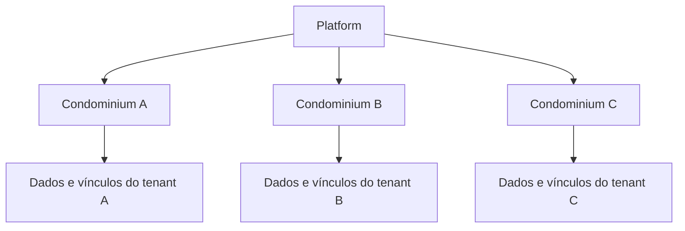
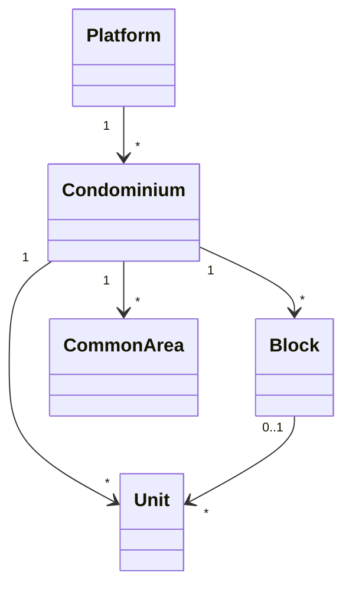
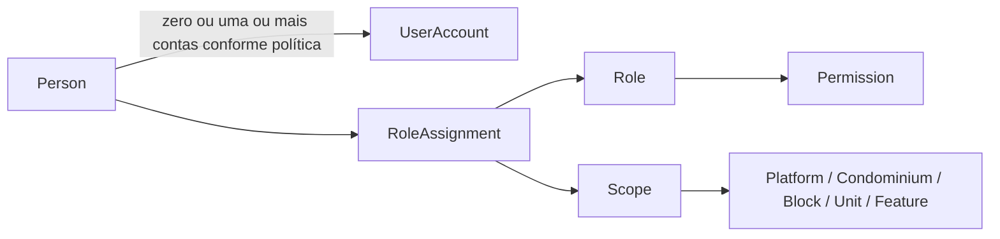
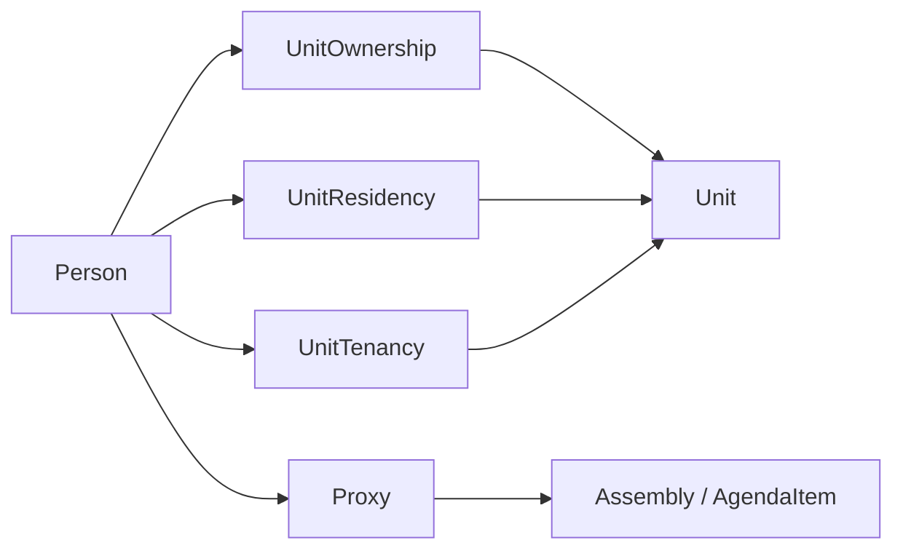
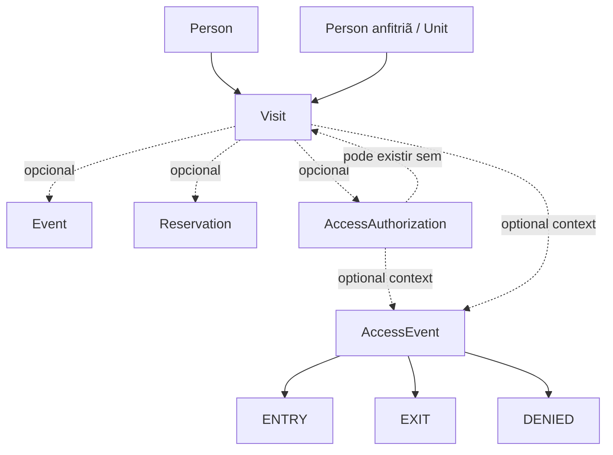
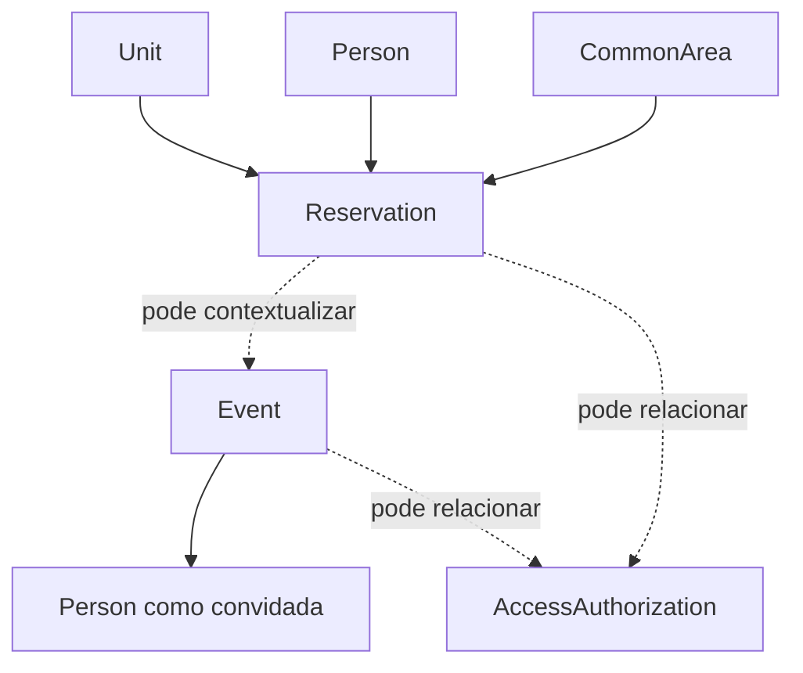
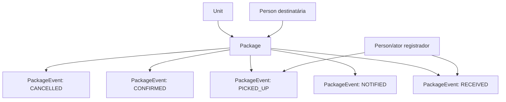
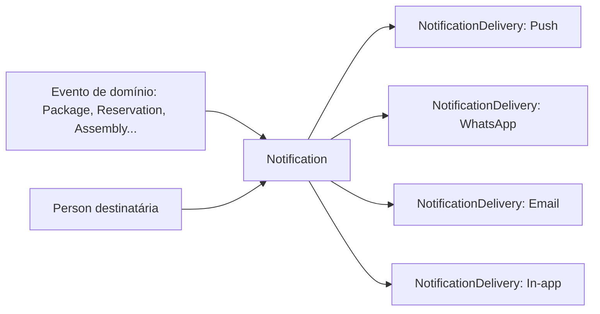
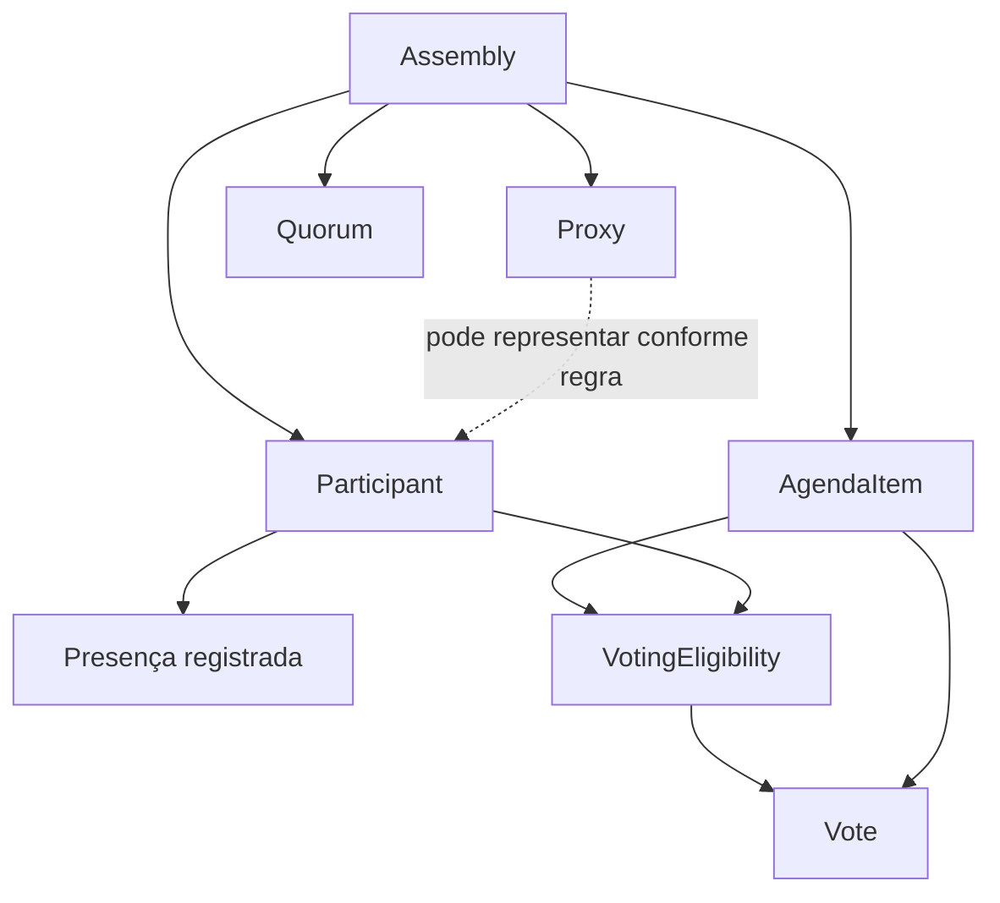
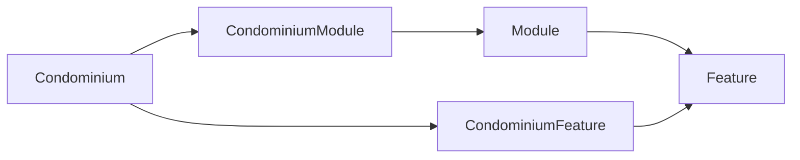

# Relacionamentos do domínio

## 1. Plataforma e tenant

`Platform` agrega condomínios. Cada condomínio é uma fronteira de contexto para blocos, unidades, áreas comuns e relações operacionais. Uma `Person` pode participar de vários tenants por vínculos separados; isso não funde nem compartilha os dados de cada condomínio.

A cardinalidade Block-Unit e a possibilidade de unidade sem bloco devem ser confirmadas para todos os tipos de propriedade.

## 2. Identidade, conta e atribuição contextual

- `Person` é a pessoa do domínio.
- `User` é o termo corrente para identidade de acesso; `UserAccount` explicita essa conta e não representa uma pessoa adicional.
- `RoleAssignment` atribui `Role` a uma pessoa em contexto `Scope`.
- `Permission` descreve ação autorizável; não é papel nem vínculo com unidade.
- A conta não cria automaticamente vínculos, papéis ou permissões.

Relação pessoa-conta (uma ou várias, possibilidade de contas compartilhadas, associação e desativação) é uma política ainda aberta.

## 3. Pessoa e vínculos com unidade

`UnitOwnership`, `UnitResidency` e `UnitTenancy` são relações semanticamente separadas. Podem coexistir para uma pessoa e unidade quando os fatos assim determinarem. Nenhum vínculo implica UserAccount, papel ou outro vínculo. `Proxy` representa delegação delimitada e não altera titularidade ou residência.

## 4. Pessoa visitante, visita, autorização e ocorrência de acesso

- Visit descreve intenção/contexto planejado ou registrado.
- AccessAuthorization é a permissão pretendida durante condições/período definidos.
- AccessEvent é um fato observado. Não é prova automática de autorização.
- Uma autorização pode não resultar em evento ENTRY; uma ocorrência DENIED pode acontecer sem autorização.
- `Visitor` e `Guest` classificam `Person` por contexto e não duplicam identidade.

## 5. Reserva, evento e convidados

Reserva associa solicitante, unidade, área e período. `Event` pode dar contexto ao uso; pessoas convidadas são relações contextuais. Aprovação, pagamento, capacidade, lista obrigatória e cancelamento seguem configuração/regra que ainda precisa ser decidida.

## 6. Pacote e histórico

`PackageEvent` registra fatos com ator e instante apropriados para cada ocorrência. `PackageDelivery` não é uma entidade principal. `Notification` e suas tentativas de entrega mantêm ciclo próprio e podem ser referenciadas pelo evento de notificação do pacote.

## 7. Notificação e canais de entrega

Uma `Notification` expressa uma intenção de comunicação. Cada `NotificationDelivery` é tentativa/resultado independente; canal não identifica provedor. A notificação pode ter zero, uma ou várias tentativas conforme política ainda a decidir.

## 8. Assembleia, presença, elegibilidade e voto

- `Participant` indica associação/participação; presença é fato separado.
- `VotingEligibility` é determinada por pauta e não é sinônimo de presença.
- `Proxy` representa somente dentro de sua validade e escopo decididos.
- `Vote` registra o voto efetivamente realizado; elegibilidade não implica voto.
- `Quorum` é apurado segundo regra humana/jurídica ainda não fechada.

## 9. Módulos e features por condomínio

`Module` agrupa capacidades conceituais; `Feature` é uma capacidade. `CondominiumModule` e `CondominiumFeature` expressam habilitação contextual por tenant. Dependências, defaults e autoridade de alteração não estão decididos. Módulo não precisa ser entidade operacional independente.

## 10. Regras de integridade conceitual

1. Não usar `UserAccount ↔ Unit` como substituto de vínculo de domínio: utilizar `UnitOwnership`, `UnitResidency` ou `UnitTenancy` conforme o fato.
2. Não representar Visitor e Guest como pessoas duplicadas quando se referem à mesma `Person`.
3. Não inferir entrada física a partir de `AccessAuthorization`; registrar `AccessEvent`.
4. Não apagar o histórico do pacote ao alterar seu status atual; registrar `PackageEvent`.
5. Não tratar `Notification` e `NotificationDelivery` como uma só ocorrência.
6. Não inferir elegibilidade, presença ou voto uns dos outros.
7. Toda relação operacional deve preservar o condomínio de contexto e impedir acesso transversal sem autorização explícita.
8. Papéis, permissões e vínculos não são intercambiáveis.

## Referências

- [domain-model.md](./domain-model.md)
- [responsibility-matrix.md](./responsibility-matrix.md)
- [../../BUSINESS-RULES.md](../../BUSINESS-RULES.md)
- [../../PERMISSIONS.md](../../PERMISSIONS.md)
- [../../OPEN-DECISIONS.md](../../OPEN-DECISIONS.md)
