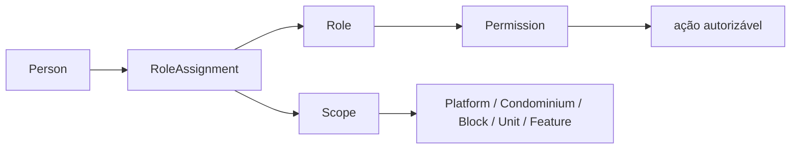

# Matriz de responsabilidades por conceito

## Como interpretar

Esta matriz identifica conceitos e seus escopos. Não concede permissões nem define uma política de acesso completa. Os papéis listados são candidatos do vocabulário do produto; o papel habilitado, suas ações e sua autoridade precisam de `RoleAssignment`, `Permission` e `Scope` no contexto correto. Onde não há decisão, a matriz marca a responsabilidade como pendente em vez de inventar uma autoridade.

| Conceito / decisão | Pessoa ou papel que pode participar | Contexto / escopo | Responsabilidade conceitual | Pendente de decisão |
|---|---|---|---|---|
| Person | qualquer pessoa representada no domínio | platform e relações tenant-scoped | Identidade de pessoa; não implica conta nem papel. | Identificação, deduplicação e dados mínimos. |
| User / UserAccount | Person associada à conta | conta, com acesso condicionado a atribuições contextuais | Autenticação e uso do produto. | Associação, recuperação, desativação e política de autenticação. |
| RoleAssignment | pessoa designada; papéis candidatos incluem `platform_admin`, `condominium_admin`, `syndic`, `property_manager`, `doorman`, `employee`, `owner`, `resident`, `tenant` | platform, condominium, block, unit ou feature | Liga pessoa, papel e escopo contextual. | Quem concede/revoga, vigência e delegação. |
| Condominium | `condominium_admin`, `syndic`, `platform_admin` conforme atribuição | condominium; funções de plataforma só em escopo platform | Manter identidade e configuração do tenant. | Fronteira de autoridade de cada papel. |
| Block / Unit / CommonArea | `condominium_admin`, `syndic`, `property_manager` como candidatos | condominium e, quando aplicável, block/unit | Manter estrutura e contexto físico. | Autoridade final e regras de manutenção/cadastro. |
| UnitOwnership | Person proprietária; `syndic`/`condominium_admin` podem participar da manutenção cadastral | condominium + unit | Representar titularidade, não conta ou residência. | Verificação, co-titularidade, documentos e alteração. |
| UnitResidency | Person residente; `syndic`/`condominium_admin` podem participar do cadastro | condominium + unit | Representar vínculo residencial. | Aprovação, comprovação, dependentes e vigência. |
| UnitTenancy | Person locatária; `syndic`/`condominium_admin` podem participar do cadastro | condominium + unit | Representar locação/ocupação. | Documentação, prazo e relação com residência. |
| Proxy | outorgante e procurador; participantes autorizados da assembleia | condomínio, assembleia e/ou pauta conforme instrumento | Representar delegação delimitada. | Formato válido, escopo, limites e verificação jurídica. |
| Reservation / Event | solicitante vinculado a unidade; `syndic`/`property_manager` podem participar | condominium + unit + CommonArea | Solicitar ou organizar uso/evento. | Aprovação, cancelamento, cobrança e convidados. |
| Visit | Person visitante e anfitrião/responsável contextual | condominium e, quando aplicável, unit/event/reservation | Descrever visita planejada ou registrada. | Campos mínimos, responsável e política de registro. |
| AccessAuthorization | solicitante/anfitrião; `doorman` verifica no processo operacional | condominium + período + referências opcionais | Expressar permissão pretendida para acesso. | Quem emite, revoga, aprova e valida exceções. |
| AccessEvent | agente/fonte que registra a ocorrência; pessoa relacionada quando identificada | ponto/condominium e contexto de autorização/visita quando disponível | Registrar ENTRY, EXIT ou DENIED como fato observado. | Captura, correção, identificação e retenção. |
| Package / PackageEvent | `doorman` ou `employee` podem registrar; destinatário pode confirmar/retirar | condominium + unit + destinatário | Preservar ciclo factual: recebimento, notificação, confirmação, retirada ou cancelamento. | Quem pode confirmar/retirar e evidências/correções. |
| Notification | serviço/capacidade do produto como autor lógico; Person como destinatário | tenant e contexto do assunto | Representar intenção de comunicação. | Conteúdo permitido, preferências e retenção. |
| NotificationDelivery | canal e sistema de entrega; destinatário como alvo | por notificação e tentativa/canal | Registrar cada tentativa/resultado independentemente. | Provedor, opt-in, retry, fallback e semântica de status. |
| Assembly / AgendaItem | `syndic`, `condominium_admin` como organizadores candidatos | condominium + assembly + agenda item | Organizar reunião e pautas. | Convocação, autoridade, agenda e procedimento. |
| Participant | Person convidada/inscrita/presente, conforme fatos separados | assembly | Representar participação sem implicar elegibilidade ou voto. | Evidência e definição de presença. |
| VotingEligibility | pessoa avaliada; regra de governança/jurídica aplicável | assembly + agenda item + unit/representation conforme regra validada | Determinar elegibilidade contextual. | Critérios e autoridade de decisão, por pauta. |
| Vote | votante elegível ou representante quando permitido | assembly + agenda item | Registrar voto efetivamente realizado. | Sigilo, opções, peso, retificação e auditoria. |
| Quorum | participantes/unidades computados conforme regra decidida | assembly ou agenda item | Representar critério de apuração. | Fórmula e consequência da ausência de quórum. |
| CondominiumModule / CondominiumFeature | `condominium_admin`/`syndic` como candidatos; `platform_admin` pode atuar em escopo de plataforma | condominium e module/feature | Registrar habilitação por condomínio. | Quem habilita/desabilita, dependências e defaults. |
| AuditLog | ator cuja ação é registrada; responsáveis de governança consultam conforme permissão | tenant ou platform de acordo com o evento | Preservar rastreabilidade de ações relevantes. | Acesso, retenção, imutabilidade e exportação. |

## Papéis não são vínculos

- `owner`, `resident` e `tenant` podem ser papéis/perfis de acesso usados por conveniência de produto, mas titularidade, residência e locação são representadas pelos vínculos `UnitOwnership`, `UnitResidency` e `UnitTenancy`.
- A atribuição de um papel não cria nem comprova vínculo com unidade.
- `Visitor` e `Guest` são classificações contextuais de `Person`, não papéis permanentes nem contas.
- `Person` pode exercer vários papéis em vários condomínios sem atravessar os limites de dados entre tenants.

## Separação role-permission-scope

Uma ação só pode ser avaliada com papel, permissão e escopo contextual. Regras de herança, negação, precedência e múltiplos papéis não estão definidas por esta matriz.

## Princípios tenant-scoped

- `Person` pode se relacionar com mais de um condomínio; cada vínculo operacional e atribuição mantém seu condomínio de contexto.
- Acesso por `UserAccount` depende de atribuições e permissões aplicáveis; presença da mesma pessoa em outro condomínio não confere acesso cruzado.
- Ações globais de `platform_admin` são distintas de ações no tenant e precisam de autorização explícita em escopo platform.
- Consultas e registros operacionais devem manter o condomínio de contexto identificável.

## Referências

- [domain-model.md](./domain-model.md)
- [relationships.md](./relationships.md)
- [../../PERMISSIONS.md](../../PERMISSIONS.md)
- [../../OPEN-DECISIONS.md](../../OPEN-DECISIONS.md)
