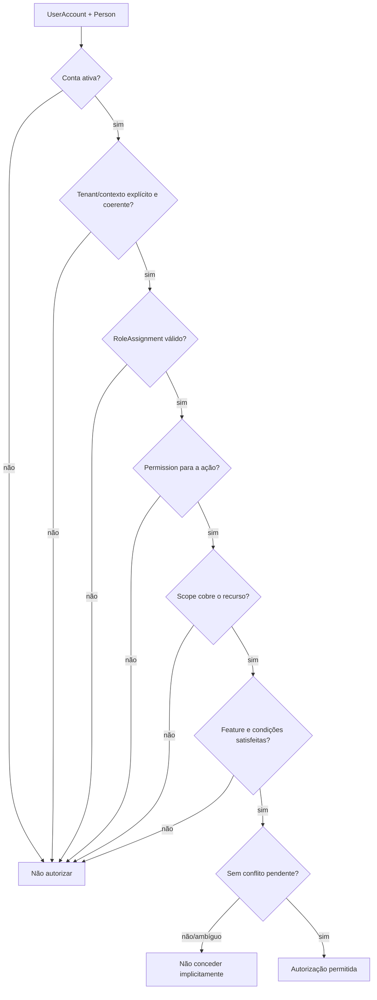

# Modelo de decisão de autorização

## Entidades conceituais

| Conceito | Responsabilidade | Não significa |
|---|---|---|
| `Person` | Pessoa do domínio, titular de relações e papéis contextuais. | Conta autenticável automaticamente. |
| `UserAccount` | Conta de acesso associada a Person conforme política. | Person, role ou vínculo de unidade. |
| `Role` | Categoria funcional nomeada. | Permissão irrestrita ou atribuição vigente. |
| `RoleAssignment` | Concede role a Person num scope, tenant e período/estado aplicáveis. | Permissão independente do role ou de outro tenant. |
| `Permission` | Capacidade/ação específica. | Acesso a todos os recursos ou dados sob qualquer scope. |
| `Scope` | Limite do grant. | Recurso sendo acessado; esses contextos devem ser comparados. |
| `Resource` | Objeto-alvo com tenant, pai/contexto e sensibilidade próprios. | Recurso autorizado só porque o sujeito o conhece. |
| `Context` | Fatos da operação: tenant selecionado, vínculo, finalidade, estado de feature, período, condição de negócio/legal. | Permissão duradoura ou universal. |

## Authorization Decision

Este diagrama expressa gates conceituais. `Review` não é um processo de implementação: representa que regra conflitante precisa ser resolvida. A recomendação de menor privilégio é negar no caso ambíguo até política final.

## Sujeito

Para ação autenticada, o sujeito inclui `UserAccount` ativa e a `Person` a ela associada no contexto da operação. `Person` sem conta pode constar como destinatária, visitante, participante ou sujeito de vínculo, mas não executa automaticamente ação autenticada. Ações realizadas por funcionário sem conta pessoal ou por processo operacional assistido precisam de definição de atribuição de autoria; não presumir ator “system” como substituto silencioso.

## Escopo do grant versus recurso

O `Scope` qualifica o grant em RoleAssignment; o recurso mantém seu próprio local e tenant. Exemplo: syndic atribuído a Condominium A pode receber, apenas se permissions e cobertura descendente assim disserem, ações sobre Units 101/202 e Assembly X pertencentes a A. Esse grant não cobre Unit 301 pertencente a B. O nome do papel ou identidade comum não muda essa decisão.

Um RoleAssignment de condomínio pode abranger recursos descendentes somente quando a permission declare sua área de atuação. Isso é abrangência declarada de recurso, não propagação automática de RoleAssignment nem herança de todos os grants.

## Regra-base de decisão

Uma autorização requer correspondência explícita entre sujeito, grant, action/permission, scope, resource e context. Nenhuma Feature habilitada, associação de pessoa, presença em condomínio ou role nominal substitui um desses requisitos. Política final de conflito ainda precisa ser aprovada.

## Condições adicionais

- Associação e estado da conta quando a ação for autenticada.
- Tenant e consistência de propriedade/contexto do recurso.
- Vigência e estado do RoleAssignment.
- Relação com unidade quando a capacidade for própria da unidade.
- Feature/module habilitada quando a operação depender dela.
- Estado de workflow, janela temporal, autorização e pré-condições do negócio.
- Elegibilidade jurídica para votar separada da permission de executar `vote.register`.
- Regras de dados pessoais por campo/finalidade.
- Classificação de risco e eventual auditoria.

## Casos não resolvidos

Identidade/cardinalidade de conta, tratamento de atores sem conta, conflitos entre allow/deny, herança de scope, exceções cross-tenant e mecanismo break-glass estão em [OPEN-DECISIONS.md](../../OPEN-DECISIONS.md).
