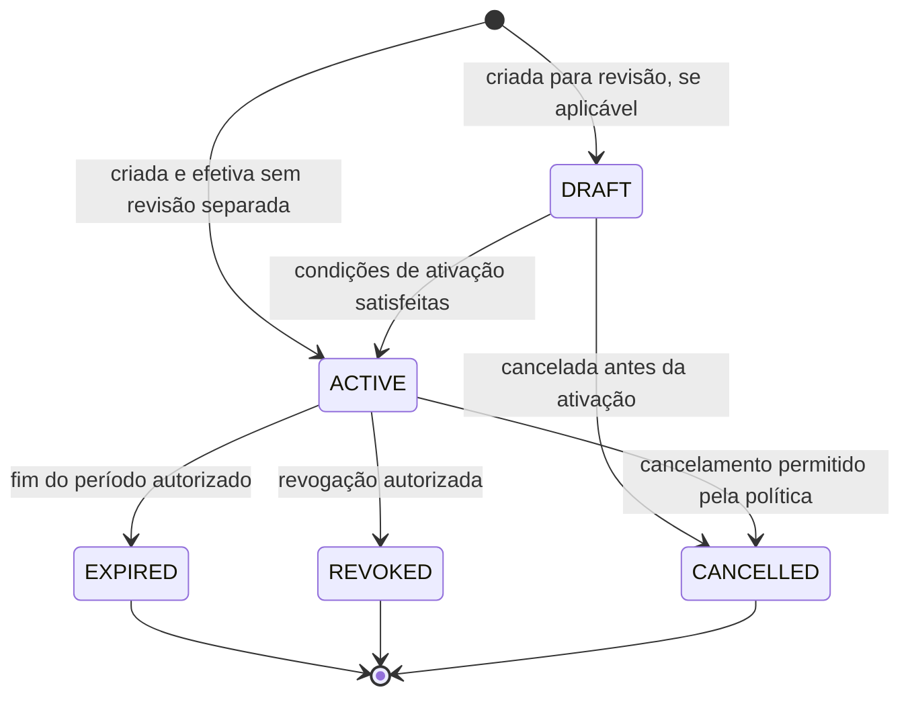

# Visitas, acesso e pacotes

Este documento detalha os workflows de [visitas e acesso](../workflows/access.md) e [pacotes/notificações](../workflows/packages-notifications.md). Todas as entidades operacionais são tenant-scoped; eventos de acesso e pacote permanecem facts, não estados. Evidência, validade, papel e escopo ainda sujeitos a decisão não são presumidos.

## AccessAuthorization

Estados: `DRAFT`, `ACTIVE`, `EXPIRED`, `REVOKED`, `CANCELLED`. `DRAFT` só se houver revisão/aprovação prévia; sem essa etapa, ativar após satisfazer condições definidas. Não adotar `PENDING_ACTIVATION` nem `USED`.

| Transição | Ator / Permission / Scope | Pré-condições, efeitos e auditoria |
|---|---|---|
| Criar → `DRAFT` ou `ACTIVE` | Solicitante com `access_authorization.create`; aprovação/ativação exige autoridade local ainda por definir; scope Unit/Block/Condominium compatível | Person/critério, tenant, finalidade, período e escopo identificáveis; Visit/Event/Reservation opcional e no mesmo tenant. Criar não significa entrada. Auditar ator, motivo, validade e referências. |
| `DRAFT` → `ACTIVE` | Aprovador conforme OD-05; permission de aprovação não está catalogada | Aprovação e guardas de política satisfeitas; autoriza tentativa apenas dentro da janela/escopo. Notificação não é condição de validade. |
| `ACTIVE` → `REVOKED` | Ator com `access_authorization.revoke` e autoridade local | Revogação impede usos futuros a partir do instante efetivo aprovado; não altera AccessEvents anteriores. Motivo/contexto e auditoria. |
| `ACTIVE` → `EXPIRED` | Regra temporal da autorização | Prazo aprovado termina. Expiração não é revogação nem prova de uso. Não estender automaticamente. |
| `DRAFT` → `CANCELLED` | Criador/ator com autoridade definida; capability específica de cancelamento não consta no catálogo | Cancelamento antes de tornar a autorização efetiva. `ACTIVE` → `CANCELLED` somente se a política distinguir cancelamento de revogação. |

**Estado inicial:** `DRAFT` quando há revisão; caso contrário `ACTIVE` só após todos os requisitos.  
**Guarda de uso:** ator que observa entrada verifica vigência, scope e condições do domínio; a autorização não confere permission ao visitante nem prova `ENTRY`.  
**Proibido:** reativar `EXPIRED`, `REVOKED` ou `CANCELLED`; usar fora do período/tenant; inferir autorização retroativa de `ENTRY`; transicionar para `USED` por ENTRY. Nova autorização exige novo ciclo.  
**Terminal/reabertura/correção:** todos os estados finais terminam o ciclo corrente. Correção de dados de autorização é auditada; não apaga nem reclassifica AccessEvents. Retentativa após expiração depende de nova autorização.  
**Notificações:** criação, ativação, revogação e expiração podem gerar comunicação conforme OD-08.  
**OPEN DECISIONS:** OD-05 (emissão, aprovação, período inclusivo, uso único/repetido, cancelamento e exceções), OD-07 e OD-18.

## AccessEvent

`AccessEvent` não possui lifecycle normal `RECORDED/CORRECTED/VOIDED`. É um fato observado cujo tipo é `ENTRY`, `EXIT` ou `DENIED`. A ocorrência original permanece; correção é referência/fato corretivo e pode mudar a interpretação atual somente conforme processo aprovado.

| Operação | Ator / Permission / Scope | Guarda, efeitos e auditoria |
|---|---|---|
| Registrar `ENTRY`, `EXIT` ou `DENIED` | Agente/fonte autorizado; `access_event.register`; scope do condomínio/ponto e recurso | Registrar somente a observação real. `ENTRY` respeita as condições de acesso exigidas; `EXIT` pode não ter `ENTRY` correspondente; `DENIED` não ativa autorização. Guardar pessoa/contexto conhecidos, ator, instante e tenant; auditar. |
| Corrigir fato | Corretor autorizado; `access_event.correct` e scope original; autoridade revisora conforme OD-05 | Referir o original, motivo quando exigido e valor corretivo; original permanece. Não criar um evento físico que não ocorreu. Auditar correção e decisão. |

`ENTRY`, `EXIT` ou `DENIED` não são states e não devem ser invertidos para ocultar divergência. Correção não altera a autorização que existia no passado nem executa saída/entrada retroativamente. Notification só se policy determinar. Duplicidade e retenção: OD-05/07/18.

## Visit

`Visit` é o contexto/intenção, não estado de acesso. Estados propostos: `PLANNED`, `CANCELLED`; `COMPLETED` e `NO_SHOW` só se houver procedimento de encerramento e janela de comparecimento aprovados. `EXPECTED`, `ARRIVED` e `INSIDE` não são estados-base:

- “esperada” é uma condição temporal derivada de uma visita planejada;
- chegada/permanência são fatos/indicadores derivados de `AccessEvent`, nunca de `AccessAuthorization`;
- `EXIT` observado não encerra automaticamente `Visit` sem regra de encerramento.

| Transição | Ator / Permission / Scope | Guardas e efeitos |
|---|---|---|
| Criar → `PLANNED` | Ator autorizado com `visit.register`; scope no Condominium e Unit anfitriã | Person/contexto e anfitrião pertencem ao mesmo tenant; Event/Reservation opcionais no mesmo tenant. Registrar criação/alteração e auditar. |
| `PLANNED` → `CANCELLED` | Ator com autoridade de gerenciamento; capability específica além de `visit.register` não consta | Cancelar contexto sem revogar/cancelar Authorization por inferência. Auditar e notificar conforme policy. |
| `PLANNED` → `COMPLETED` | Ator/procedimento a definir | Somente se política de encerramento estabelecer quais fatos bastam; não presumir saída a partir da ausência de presença atual. |
| `PLANNED` → `NO_SHOW` | Regra local de janela/finalização e autoridade a definir | Só depois do período de comparecimento aprovado e sem chegada registrada; absence of event não basta sem janela definida. |

**Proibido:** criar `ARRIVED`/`INSIDE` sem evento observado; usar a autorização como presença; inferir `NO_SHOW` imediatamente; reabrir visita cancelada/concluída sem regra. `AccessEvent` e `AccessAuthorization` seguem lifecycles próprios.  
**Permissões/auditoria:** `visit.register`/`visit.read` são existentes; gerenciamento posterior e autorização do anfitrião requerem grants aplicáveis. Auditar alteração/cancelamento/correção e tenant.  
**OPEN DECISIONS:** OD-05/07, incluindo cancelamento, no-show, conclusão e eventuais transições de chegada/saída.

## Package status derivado

O modelo atual não fixa um `Package.status` autoritativo. Se uma situação corrente for necessária, esta é uma projeção conceitual derivada de fatos válidos, não uma cópia de `PackageEvent`:

| Situação corrente proposta | Evidência necessária | Limite |
|---|---|---|
| `IN_CUSTODY` | Um `PackageEvent(RECEIVED)` válido, sem fechamento válido posterior | `NOTIFIED` ou `CONFIRMED` não muda custódia. |
| `RELEASED` | `PackageEvent(PICKED_UP)` válido | `PICKED_UP` é fato; `RELEASED` é a situação derivada. Confirmação não é suficiente. |
| `CANCELLED` | `PackageEvent(CANCELLED)` válido e política permite cancelamento naquele ponto do ciclo | Não apaga fatos anteriores; efeitos após retirada dependem de OD-06. |

Não se define situação antes de `RECEIVED`, múltiplos eventos de retirada, destino contestado nem transição de `CANCELLED` de volta à custódia. Estado/projeção só pode ser apresentado se essa regra for aprovada. Um evento corretivo posterior preserva a ocorrência original.

## PackageEvent

Vocabulário de fatos: `RECEIVED`, `NOTIFIED`, `CONFIRMED`, `PICKED_UP`, `CANCELLED`. Não são estados do `Package`. A sequência factual começa por recebimento físico; NOTIFIED requer pacote registrado; `CONFIRMED` e `PICKED_UP` referem-se ao pacote específico. Outros ordenamentos e cancelamento após retirada dependem de OD-06.

| Evento/ação | Ator / Permission / Scope | Pré-condições, efeitos e auditoria |
|---|---|---|
| `RECEIVED` | Registrador autorizado; `package.register`; scope da Unit/Condominium | Encomenda fisicamente recebida e contexto/destino resolvidos ou explicitamente pendentes. Registrar quem recebeu, quem registrou, instante e tenant. Gatilho de Notification não prova entrega. |
| `NOTIFIED` | Ator/processo com `package.notify`; mesmo pacote/tenant | Comunicação iniciada/registrada; relacionar Notification se existir. Entrega depende de `NotificationDelivery`. |
| `CONFIRMED` | Destinatário/representante/ator permitido; `package.confirm` e relação/autoridade aprovada | Pacote específico e evidência/contexto conforme OD-06; registrar pessoa e instante. Não prova retirada. |
| `PICKED_UP` | Observador/registrador autorizado; `package.release`; actor/representante validado segundo OD-06 | Retirada física observada; identidade do retirante e instante quando conhecidos. Não exigir CONFIRMED sem decisão. |
| `CANCELLED` | Ator e authority conforme política; permission específica não consta na taxonomia além das operações package aplicáveis | Motivo/contexto; não apagar fatos prévios; validar se a fase aceita cancelamento. |
| Correção de qualquer evento | Corretor autorizado; `package.correct`, scope do pacote e revisão quando definida | Referenciar evento original; registrar autor/motivo e correção; não substituir evento silenciosamente. |

**Duplicidade:** segundo evento igual não significa segundo ato físico. Confirmar, registrar presença de custódia ou retirada novamente é classificado no catálogo central e OD-18; sem evidência de evento distinto, encaminhar/rejeitar ou tratar como repetição conforme decisão aprovada.  
**Terminais/reversibilidade:** `PICKED_UP` e `CANCELLED` podem ser tratados como término da custódia na projeção, não como fatos apagáveis; sua reversão exige correção ligada ao original ou novo fato justificado, não reabertura silenciosa.  
**Notificações/auditoria:** failure de NotificationDelivery não desfaz PackageEvent. Recebimento, confirmação, retirada, cancelamento e correção são auditáveis.  
**OPEN DECISIONS:** OD-06/07/18 cobrem atores, confirmação/retirada, sequência, correção, estado projetado e repetição.
