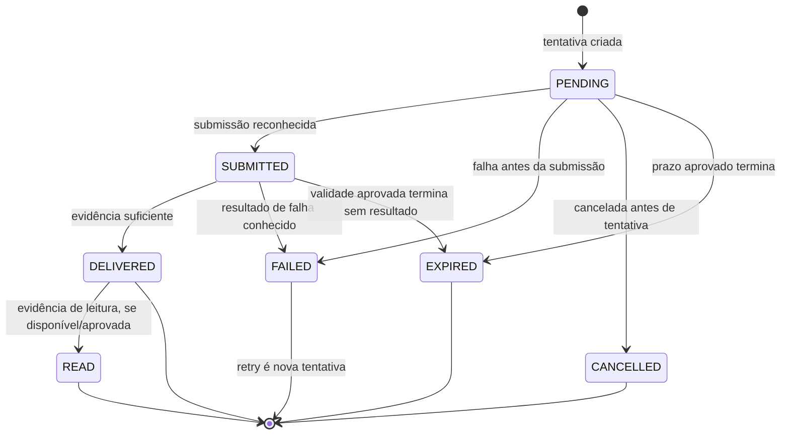
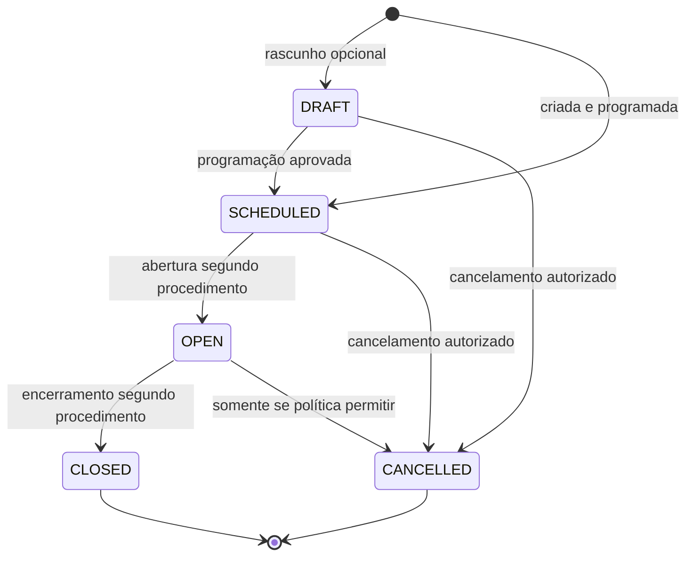

# Notificações, assembleias e votação

As máquinas abaixo complementam [o workflow de pacotes e notificações](../workflows/packages-notifications.md) e [o workflow de assembleia](../workflows/assemblies.md). Entrega, presença, elegibilidade, representação, voto, apuração e publicação são dimensões separadas.

## Notification

`Notification` é intenção lógica de comunicação, não resultado de entrega. Estado mínimo proposto: `CREATED` e, se houver cancelamento de envios futuros, `CANCELLED`. `QUEUED` e `PROCESSING` são excluídos por expressarem execução técnica; `COMPLETED`, `PARTIALLY_DELIVERED` e `FAILED` são resultados agregados derivados das `NotificationDelivery`s, não estados canônicos da Notification.

| Transição | Ator / Permission / Scope | Guardas e efeitos |
|---|---|---|
| Criar → `CREATED` | Gatilho de negócio ou ator com `notification.create`; tenant e finalidade da origem | Destinatário, finalidade, conteúdo autorizado, privacy e preferências aplicáveis validados. Criação não afirma envio. Auditar quando sensível. |
| `CREATED` → `CANCELLED` | Ator/capability de cancelamento não consta no catálogo; authority por decidir | Impedir tentativa nova conforme policy; manter tentativas/eventos já ocorridos. Não desfazer fato fonte. |

Sem cancelamento, a intenção pode ficar `CREATED` enquanto suas tentativas são acompanhadas; não inferir estado final global. Criar outra tentativa não reabre nem duplica a intenção por si só. OD-08 decide validade, cancelamento, finalização e eventual agregação. `notification.read/create` e `notification.delivery.read` são capabilities existentes; scope e tenant da origem/destinatário são guardas.

## NotificationDelivery

Cada canal/tentativa tem ciclo próprio: `PENDING` → `SUBMITTED` → resultado comprovável. `SUBMITTED` significa encaminhada/aceita para processamento fora do domínio e não significa `DELIVERED`. `RETRYING` não é estado: cada nova tentativa é outra NotificationDelivery. `EXPIRED` só existe se uma validade de tentativa for aprovada.

| Estado/ação | Ator / Permission / Scope | Guarda, efeito, notificação/auditoria |
|---|---|---|
| Criar → `PENDING` | Processo/ator com `notification.create`; tenant da Notification | Canal configurado e permitido, destinatário/finalidade válidos. O nome do canal não identifica provedor. |
| `PENDING` → `SUBMITTED` | Resultado de tentativa, não transição autorizada por papel de negócio | Somente se existe evidência de submissão; não declarar entrega. Registrar instante e evidência possível. |
| `PENDING`/`SUBMITTED` → `DELIVERED` | Resultado observável da tentativa | Evidência suficiente segundo canal/policy; a mensagem chegou ao status conhecido, sem inferir leitura. |
| `DELIVERED` → `READ` | Somente receipt/evidência de leitura confiável para o canal | Resultado opcional, não disponível universalmente; registrar como tal sem inferir comportamento de outro canal. |
| `PENDING`/`SUBMITTED` → `FAILED` | Resultado de falha conhecido | Registrar falha sem apagar histórico; retry separado. |
| `PENDING` → `CANCELLED` | Authority/capability ainda por definir | Somente se cancelável antes do resultado irreversível; não remove tentativa submetida nem apaga evidência. |
| Qualquer estado não final → `EXPIRED` | Regra de validade aprovada, caso exista | Expiração da tentativa conforme OD-08; não significa falha do fato fonte nem cancelamento da Notification. |

**Terminal/reversível:** `READ`, `FAILED`, `CANCELLED`, `EXPIRED` encerram a tentativa. `DELIVERED` encerra a entrega, mas pode receber evidência posterior de leitura se essa distinção existir. Corrigir resultado exige evidência e trilha; não reiniciar status terminal. Nova tentativa é nova entrega.  
**Proibido:** `SUBMITTED` → `DELIVERED` sem evidência; falha reescrita como sucesso; repetir tentativa apagando outra; qualquer resultado de entrega modificar estado do workflow de negócio.  
**OPEN DECISIONS:** OD-08 e OD-18 (evidência de resultado, retry/fallback, TTL, duplicidade e encerramento agregado).

## Assembly

Estados: `DRAFT`, `SCHEDULED`, `OPEN`, `CLOSED`, `CANCELLED`. `IN_PROGRESS` é redundante com `OPEN` no modelo-base; etapa de `VOTING` pertence a AgendaItem. Convocação, quorum, resultado e publicação são fatos/etapas, não estados de Assembly automaticamente.

| Transição | Ator / Permission / Scope | Pré-condições, efeitos, notificação e auditoria |
|---|---|---|
| Criar → `DRAFT`/`SCHEDULED` | Organizador com `assembly.manage`, scope do Condominium | Assembly, data/local e dados exigidos por regra aprovada; agenda vinculada ao mesmo tenant. Criar/alterar/convocar são fatos auditáveis. |
| `DRAFT` → `SCHEDULED` | `assembly.manage` e processo de convocação aprovado | Pré-condições de convocação satisfeitas. Notificação é independente e não prova validade da convocação. |
| `SCHEDULED` → `OPEN` | `assembly.open` no Condominium | Momento e procedimento aprovados; readiness/convocação/quorum quando aplicáveis. |
| `OPEN` → `CLOSED` | `assembly.close` | Procedimento e fechamento satisfeitos; impede novas ações dentro das pautas encerradas conforme OD-01. Apuração/publicação são atos distintos. |
| `DRAFT`/`SCHEDULED` → `CANCELLED` | Authority `assembly.manage` conforme política | Preservar convocações, materiais e outras evidências; comunicação conforme policy. `OPEN` → `CANCELLED` somente se processo aprovado permitir. |

**Estado inicial:** `DRAFT` quando elaboração separada for necessária; caso contrário `SCHEDULED` após criação/programação.  
**Terminal:** `CLOSED` e `CANCELLED` encerram ciclo normal; `CLOSED` não quer dizer resultado juridicamente válido/publicado.  
**Proibido:** votar antes de Assembly aberta e item em `VOTING`; reabrir fechada/cancelada sem regra; cancelar apagando participantes/votos; usar `VOTING` como estado da Assembly.  
**Reabertura/correção:** reopening exige procedimento legal e authority definidos por OD-01. Correção de dado/fato fechado preserva a versão anterior.  
**OPEN DECISIONS:** OD-01/02/07; convocação e condições de abertura, encerramento, cancelamento, ausência de quorum, validade e reabertura.

## AgendaItem

Estados propostos: `DRAFT`, `OPEN`, `VOTING`, `CLOSED`, `CANCELLED`. `OPEN` significa pauta aberta para condução/discussão; `VOTING` significa janela de voto aberta; `CLOSED` significa encerrada para novas ações ordinárias. `DECIDED` não é usado: resultado apurado é informação/fato separado.

| Transição | Ator / Permission / Scope | Guardas e efeitos |
|---|---|---|
| Criar → `DRAFT` ou `OPEN` | `assembly.manage`; tenant/Assembly corretos | Conteúdo e sequência conforme procedimento aprovado; alterações ficam auditadas. |
| `DRAFT` → `OPEN` | `assembly.manage`; Assembly em `OPEN` quando exigido | Pauta habilitada segundo política. |
| `OPEN` → `VOTING` | Autoridade/procedimento da Assembly; não há permission separada `agenda_item.vote.open` | Regra de elegibilidade, modalidade, janela e demais condições OD-01 satisfeitas. |
| `VOTING` → `CLOSED` | Responsável com autoridade de encerramento da pauta; `assembly.close` é capability existente | Janela/procedimento de votação encerrado; impedir novos votos ordinários. Apuração é distinta. |
| `DRAFT`/`OPEN` → `CANCELLED`; `VOTING` → `CANCELLED` somente se permitido | `assembly.manage`/`assembly.close` conforme autoridade aprovada | Cancelamento de pauta sem apagar votos/fatos existentes; efeito jurídico é OD-01. |
| `CLOSED` → `VOTING` | Apenas por procedimento formal aprovado | Não permitido por operação ordinária; preservar fechamento anterior e auditoria. |

**Inicial:** `DRAFT` ou `OPEN`, conforme fluxo aprovado. **Terminais:** `CLOSED`, `CANCELLED`; reabertura apenas por procedimento. **Notificação:** alteração de pauta pode notificar segundo policy, independente da entrega. **OPEN DECISIONS:** OD-01 (autoridade, janela, fechamento, resultado e reabertura).

## Participant

`Participant` é vínculo de uma Person com Assembly, não máquina jurídica de direito de voto. `REGISTERED` é a condição inicial se existe inscrição/convocação. Presença é registrada como fato separado; se a aplicação necessitar classe de attendance, `PRESENT`/`ABSENT` são classificações por política. `REPRESENTED` não é estado: é relação com Proxy válida e fato de uso; `LEFT` é ocorrência, não estado final.

| Evento/ação | Ator / Permission / Scope | Guardas e efeitos |
|---|---|---|
| Registrar Participant | Ator com `participant.manage` | Person e Assembly no mesmo tenant; convite/inscrição registrado, sem inferir presença ou elegibilidade. |
| Registrar presença | Ator com `participant.presence.register` | Observação conforme método aprovado; registrar instante/ator e auditar. Repetição não soma presença/quorum. |
| Registrar saída | Ator autorizado pelo processo | Fato de saída da sessão, se observado; não reescreve presença registrada nem implica saída do condomínio. |
| Classificar `ABSENT` | Processo/ator e janela OD-01/07 | Só após encerramento da janela de presença e com critério aprovado. Ausência de dado antes disso não é ausência. |
| Corrigir presença/inscrição | Permission `participant.manage` ou permission específica a aprovar; tenant/Assembly original | Referenciar original, registrar motivo/autor; não apagar trilha. |

No estado inicial não se presume attendance. Participant pode estar `PRESENT` e depois `LEFT`; relação permanece. Finalização de attendance é dependente de OD-01. Presença não implica elegibilidade ou voto. Eventos e correções exigem auditoria; visibilidade respeita OD-07.

Notificação a participante é opcional conforme policy, não transição de presença. Não há estado terminal universal para a relação; saída/correção são fatos e Assembly encerrada não apaga o Participant.

## VotingEligibility

É decisão/condição contextual por Person e AgendaItem, não uma permission ou máquina temporal genérica. Valores candidatos são `ELIGIBLE` e `INELIGIBLE`; `CONTESTED` somente se processo de contestação for aprovado. `SUSPENDED` é excluído por confundir elegibilidade com autorização.

| Ação | Ator / Permission / Scope | Guardas, efeito e auditoria |
|---|---|---|
| Determinar | Ator com `voting_eligibility.determine`; scope do Condominium, Assembly e AgendaItem no mesmo tenant | Aplicar regra identificável aprovada e fatos pertinentes; registrar pessoa/pauta/critério/data e ator, sem inferir de presença ou de Permission. |
| Contestar/reavaliar/corrigir | Authority/procedimento a decidir; `voting_eligibility.determine` para nova avaliação | Registrar decisão nova e relação com a anterior; não sobrescrever silenciosamente. |

Resultado para uma pauta não se estende a outra. Alteração de vínculo ou informação relevante só afeta elegibilidade conforme regra aplicável, não retroativamente por inferência. **OPEN DECISIONS:** OD-01/07, direitos, critério, autoridade, disputa e efeitos sobre voto registrado.

## Quorum

`Quorum` é uma avaliação/resultado de regra, não uma máquina de estado base. Não existem `PENDING/ACHIEVED/FAILED` universais aprovados; a conclusão depende da composição, janela, regra por assembleia/pauta e momento de apuração definidos em OD-01.

| Ação | Ator / Permission / Scope | Guardas, efeito e auditoria |
|---|---|---|
| Consultar avaliação | Ator com `quorum.read`; tenant e Assembly/AgendaItem compatíveis | A leitura respeita finalidade, sigilo e visibilidade. |
| Apurar/registrar resultado | Autoridade e capability de apuração ainda não catalogadas; `assembly.result.read` é leitura, não permissão de calcular | Usar regra identificável aprovada e fatos válidos de presença/representação/elegibilidade; registrar momento, escopo, fonte/regra e autor; auditar. Resultado não significa publicação nem validade jurídica automática. |
| Corrigir/reapurar | Autoridade/procedimento a definir; permission específica a decidir | Preservar apuração anterior, motivo e referência; reabrir deliberação apenas conforme OD-01. |

Apuração não altera presença, eligibilidade, Proxy ou Vote. Notificação de resultado depende de publicação aprovada; não existe transição automática `CLOSED → valid`. Sem regra aprovada, não apresentar resultado como deliberação validada.

## Proxy

Estados: `PENDING_VALIDATION` quando houver etapa de validação; `ACTIVE` após validade reconhecida; `REJECTED` quando o instrumento/escopo não for aceito segundo procedimento; `REVOKED`; `EXPIRED`. `DRAFT` não é necessário no modelo-base. `USED` é um fato de utilização, não estado, pois o escopo pode autorizar atos em mais de uma pauta.

| Transição | Ator / Permission / Scope | Guardas e efeitos |
|---|---|---|
| Registrar → `PENDING_VALIDATION` ou `ACTIVE` | Outorgante/ator permitido; `proxy.register`; tenant + Assembly/AgendaItem como contexto | Outorgante, representante, instrumento, escopo e período informados; validação jurídica necessária quando aplicável. |
| `PENDING_VALIDATION` → `ACTIVE`/`REJECTED` | Validador com authority a definir; `proxy.register` não determina validade jurídica | Forma, período, conflito e elegibilidade conforme OD-01. Auditar decisão e evidência minimizada. |
| `ACTIVE` → `REVOKED` | Outorgante/ator permitido; `proxy.revoke` | Validade de revogação e efeitos sobre atos anteriores definidos por regra; manter usos passados. |
| `ACTIVE` → `EXPIRED` | Fim do período/escopo aprovado | Não estender a outra Assembly/AgendaItem. Usos passados permanecem. |

`USED` registra que a representação foi exercida e em que ato permitido; não extingue a autorização universalmente. Rejeitado, revogado e expirado terminam o ciclo; nenhum pode voltar a ativo silenciosamente. Conflitos/duplicidade impedem uso enquanto não resolvidos. `Proxy` não cria RoleAssignment nem Permission. **OPEN DECISIONS:** OD-01/02 (outorga, validação, limites, múltiplos representantes, revogação e efeito após uso).

## Vote

Vote é fato: nasce como `RECORDED` quando submetido/registrado com sucesso. `DRAFT` não é necessário no modelo-base; `CAST` não é estado separado de `RECORDED`. `INVALIDATED` só é resultado de correção formal autorizada e não exclusão do voto original.

| Ação/transição | Ator / Permission / Scope | Guardas, efeitos e auditoria |
|---|---|---|
| Registrar → `RECORDED` | Votante com `vote.participate`, ou registrador com `vote.register`; scope de Condominium + Assembly/AgendaItem | Assembly aberta, AgendaItem em `VOTING`, elegibilidade determinada como válida, representação válida se aplicada, janela/modo/opções aprovados. Registrar só o voto permitido; auditar sem violar sigilo aplicável. |
| Corrigir/anular → `INVALIDATED` | Ator autorizado com `vote.correct`/`vote.cancel`, autoridade de revisão conforme OD-01 | Motivo, fundamento e referência ao original; o original permanece; novo voto só se procedimento permitir e deve ficar ligado à correção. |

**Proibido:** registrar fora da pauta/janela; derivar elegibilidade de permission/presença; permitir múltiplos votos silenciosamente quando a regra exigir um; modificar resposta em lugar sem trilha; alterar resultado por correção do voto sem re-apuração segundo regra aprovada.  
**Terminal/reabertura:** voto registrado não é editável no ciclo normal. `INVALIDATED` não é reversível diretamente; eventual novo voto é ato novo sujeito às condições da pauta. Fechar item impede novos votos, salvo reabertura formal.  
**Notificação:** resultados e recibos conforme regras de sigilo; entrega não valida o voto. **OPEN DECISIONS:** OD-01/07/18 (unicidade, substituição, invalidação, segredo, janela, apuração e auditoria).
