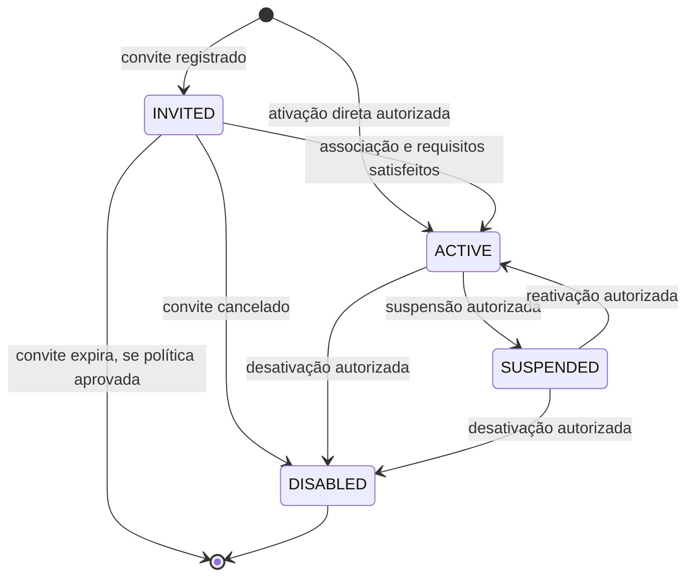
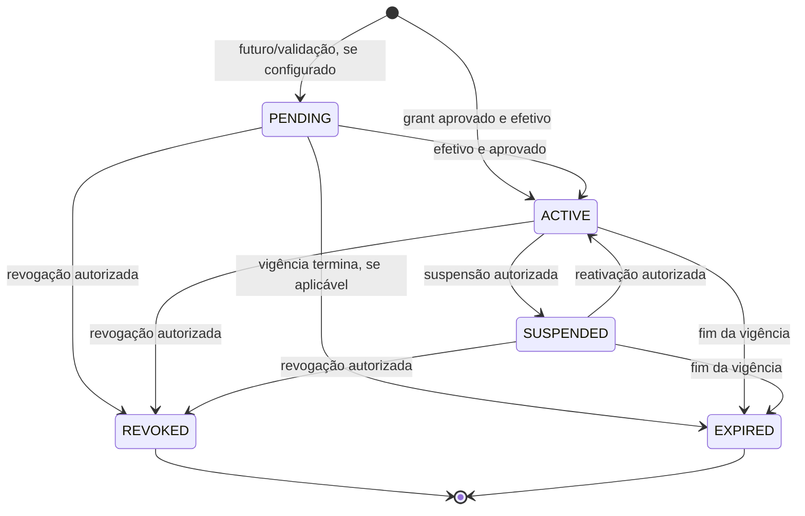
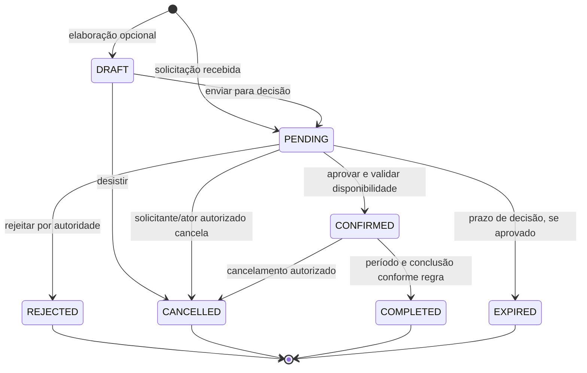

# Identidade, vínculos, áreas e reservas

Os estados deste documento refinam os workflows [de identidade e unidade](../workflows/identity-and-units.md), [de papéis](../workflows/roles.md) e [de reservas/eventos](../workflows/reservations-events.md). A matriz de permissões é baseline proposta, não concessão aprovada. Todo recurso tenant-scoped exige tenant coerente; uma transição não move nem amplia o recurso para outro condomínio.

## UserAccount

### Modelo

Estados conceituais: `INVITED`, `ACTIVE`, `SUSPENDED`, `DISABLED`. `PENDING_ACTIVATION` duplica o significado de convite ainda não ativado; `EXPIRED` não é estado de conta no modelo-base, pois expiração pode encerrar o convite sem encerrar a conta da pessoa.

Expiração de convite é terminal para aquele convite; o desenho `[ * ]` não afirma que a `UserAccount` completa foi apagada. Convite expirado/reemitido, aceitação e associação de conta são decisões OD-03.

| Transição | Ator / Permission / Scope | Pré-condições e guardas | Efeito, eventos, notificação e auditoria |
|---|---|---|---|
| Criação → `INVITED` | Ator com autoridade de convite ainda não definida; `user_account.*` não existe no catálogo | Person identificada, tenant/finalidade de convite apropriados; não presumir grant | Registra convite e associação proposta. Mensagem opcional via Notification; falha não ativa conta. Auditar ator/alvo/contexto. |
| Criação → `ACTIVE` | Autoridade de ativação ainda não definida | Somente se fluxo de ativação direta estiver aprovado e associação Person verificada | Ativa capacidade de autenticação; não cria RoleAssignment. Auditar. |
| `INVITED` → `ACTIVE` | Ator/aceite conforme OD-03; permission não catalogada | Associação válida a Person e requisitos aprovados | Permite ações autenticadas somente se cada grant/permission/scope também for válido. Registrar ativação; notificação não é pré-condição universal. |
| `INVITED` → cancelado/expirado | Ator e regra de validade a decidir | Convite não aceito; limite temporal e autoridade aprovados | Encerra apenas a oportunidade do convite; sem apagar Person ou vínculos. Auditar. |
| `ACTIVE` → `SUSPENDED` | Autoridade/capability ainda a decidir | Motivo, alcance e efeito temporal conforme política | Bloqueia novas ações autenticadas; não suspende Person nem apaga RoleAssignments. Auditar; comunicar conforme OD-08. |
| `SUSPENDED` → `ACTIVE` | Autoridade/capability ainda a decidir | Suspensão removida legitimamente; conta não está disabled | Restaura condição de conta apenas; não reativa assignments suspensos/revogados/expirados. Auditar. |
| `ACTIVE`/`SUSPENDED` → `DISABLED` | Autoridade/capability ainda a decidir | Desativação permitida; alcance e irreversibilidade conforme OD-03 | Bloqueia novas ações autenticadas; preserva associação/histórico conforme privacidade. Auditar. |

**Estado inicial:** convite ou ativação aprovada; não há criação automática de conta por existir Person.  
**Permissões e scope:** o catálogo não contém `user_account.*`; não substituir por `person.update`. Definir autoridade e escopo em OD-03 antes de implementação. A desativação da conta afeta autenticação global, não altera as autorizações tenant-scoped por si só.  
**Transições proibidas:** conta não associada a Person ativa; `SUSPENDED` executando novas ações autenticadas; reativar `DISABLED` por rotina comum; convite gerar RoleAssignment ou acesso por si só.  
**Terminal/reabertura/correção:** `DISABLED` é terminal no modelo proposto; eventual recuperação/reassociação é decisão OD-03, auditada, sem restaurar direitos históricos automaticamente. Correção da associação não transfere autoria ou histórico entre pessoas.

## RoleAssignment

Estados: `ACTIVE`, `SUSPENDED`, `REVOKED`, `EXPIRED`; `PENDING` só se uma regra aprovada criar grant futuro ou exigir validação antes da vigência. `REVOKED` é encerramento antecipado deliberado; `EXPIRED` é término por fim da vigência; `SUSPENDED` pausa temporária reversível.

| Transição | Ator / Permission / Scope | Guardas e efeito |
|---|---|---|
| Criação → `ACTIVE` ou `PENDING` | Concessor com `role_assignment.grant`, scope do grant alvo limitado à própria autoridade | Person, Role, tenant, Scope e vigência coerentes; não autoelevar. `PENDING` apenas com política aprovada. Auditar grant e eventual notificação; notificação não ativa. |
| `PENDING` → `ACTIVE` | Autoridade com `role_assignment.grant`; scope do assignment | Aprovação e início efetivo satisfeitos; somente capabilities do RoleAssignment válido passam a ser consideradas. |
| `ACTIVE` → `SUSPENDED` | `role_assignment.suspend`; mesmo limite de authority/scope | Suspensão explícita e auditada; impede uso futuro depois do instante efetivo, sem invalidar ações passadas. |
| `SUSPENDED` → `ACTIVE` | `role_assignment.reactivate`; mesmo limite | Remoção legítima da suspensão. Não restaura grants distintos expirados/revogados. |
| `PENDING`/`ACTIVE`/`SUSPENDED` → `REVOKED` | `role_assignment.revoke`; authority compatível | Revogação antecipada deliberada; terminal. Preserva histórico. |
| `PENDING`/`ACTIVE`/`SUSPENDED` → `EXPIRED` | Condição temporal aprovada; evento `expired` é fato do término | Fim da vigência definida; terminal e distinto de revogação. Sem extensão silenciosa. |

**Estado inicial:** grant aprovado e efetivo; `PENDING` não é obrigatório.  
**Pré-condições globais:** conta ativa para ação autenticada; actor válido; scope/resource/tenant coerentes; grant não superior à autoridade do concessor; conflito e delegação sob OD-02/14/15/16.  
**Proibido:** usar suspended/revoked/expired; mudar tenant ou scope por transferência implícita; reativar `REVOKED`/`EXPIRED`; ativar grant superior sem delegação; apagar a trilha. Para retomar acesso após revogação/expiração, novo assignment.  
**Notificações/auditoria:** comunicação não concede nem revoga. Grant, suspensão, reativação, revogação e expiração devem permanecer auditáveis.  
**Reabertura/correção:** apenas `SUSPENDED` pode voltar a `ACTIVE` por `role_assignment.reactivate`; término incorreto exige correção auditada ou novo grant, nunca ressuscitação silenciosa.

## UnitOwnership, UnitResidency e UnitTenancy

São três relações independentes, sem herança de estado entre si. `FUTURE`, `ACTIVE`, `ENDED` descrevem condição temporal proposta, não um enum final obrigatório:

- `FUTURE`: início efetivo no futuro somente quando datas futuras forem permitidas por OD-09.
- `ACTIVE`: dentro do período efetivo e não encerrado.
- `ENDED`: prazo concluído ou encerramento autorizado.

| Transição | Ator / Permission / Scope | Guardas, efeito e fatos |
|---|---|---|
| Criação → `FUTURE` ou `ACTIVE` | Mantenedor autorizado; `unit_ownership.manage`, `unit_residency.manage` ou `unit_tenancy.manage`; scope Unit ou Condominium cobrindo explicitamente a Unit | Pessoa, Unit e Condominium coerentes; prova e authority conforme OD-09; criar apenas o tipo de vínculo solicitado. Registrar início, autor e contexto. |
| `FUTURE` → `ACTIVE` | Decorre da data efetiva definida, se regra temporal aprovada | Não implica conta, papel ou os outros tipos de vínculo. |
| `ACTIVE` → `ENDED` | Ator com permission `.manage` correspondente e authority aprovada, ou fim temporal conforme regra | Registrar data/motivo aplicáveis; preservar o vínculo e suas relações históricas. |
| Correção de datas/dados | Mesma permission específica, além de `audit_log.read` quando necessário | Corrigir preservando valor anterior, autor, referência e motivo exigido. |

**Estado inicial:** `FUTURE` ou `ACTIVE` conforme data e política; não inventar `PENDING` de aprovação sem workflow.  
**Guardas:** tenant da Unit e da relação é único; não transferir vínculo a outra Unit/condomínio. Sobreposição e copropriedade não são proibidas universalmente.  
**Terminal/reabertura:** `ENDED` encerra a relação; correção autorizada pode corrigir sua data, mas não apaga o período anterior. Nova relação é um novo vínculo, não reabertura automática. `UnitOwnership`, `UnitResidency` e `UnitTenancy` não alteram `UserAccount` ou `RoleAssignment`.

## CommonArea

Estados de disponibilidade propostos: `ACTIVE`, `BLOCKED`, `MAINTENANCE`, `DISABLED`. São estados de disponibilidade operacional, não fatos de reserva. A distinção temporal entre bloqueio, manutenção e indisponibilidade permanente depende da política local.

| Transição | Ator / Permission / Scope | Guardas e efeito |
|---|---|---|
| Criação/configuração → estado inicial | `common_area.manage` no Condominium/Block compatível | Área e tenant coerentes; disponibilidade/configuração inicial aprovadas. Auditar. |
| `ACTIVE` → `BLOCKED`/`MAINTENANCE` | `common_area.manage` | Motivo e período/contexto identificáveis; identificar reservas afetadas sem cancelá-las ou alterá-las silenciosamente. Notificar afetados se policy exigir; auditar. |
| `BLOCKED`/`MAINTENANCE` → `ACTIVE` | `common_area.manage` | Condição de reabertura satisfeita; confirmar impacto das reservas conforme OD-04. |
| Estado operacional → `DISABLED` | `common_area.manage` | Encerramento autorizado; preservar reservas e eventos históricos; decidir destino das reservas vigentes conforme OD-04. |
| `DISABLED` → `ACTIVE` | `common_area.manage`, se reativação permitida | Revisar configuração e disponibilidade; não restaurar reserva nem criar booking automaticamente. |

**Estado inicial:** depende da configuração aprovada. `BLOCKED` e `MAINTENANCE` podem ser estados temporários; `DISABLED` retira a capacidade de reservar.  
**Proibido:** confirmar Reservation numa área indisponível; converter automaticamente reservas afetadas em canceladas/concluídas; apagar histórico.  
**Terminais/reabertura:** `DISABLED` é terminal para a utilização corrente, mas reativação pode ser autorizada. Período, regra de operação em curso e destino das reservas afetadas permanecem em OD-04/11.

## Reservation

Estados selecionados: `DRAFT`, `PENDING`, `CONFIRMED`, `REJECTED`, `CANCELLED`, `COMPLETED`; `EXPIRED` somente se houver validade aprovada para uma solicitação não decidida. `IN_PROGRESS` não é adotado: início/fim não são definidos como fatos de estado e a utilização no período pode ser uma condição derivada.

| Transição | Ator / Permission / Scope | Pré-condições, guardas e efeitos |
|---|---|---|
| Criar → `DRAFT`/`PENDING` | Person/ator autenticado; `reservation.create`; scope Unit/Condominium compatível | Unit, CommonArea e pessoa no mesmo tenant; vínculo e feature se exigidos; período e requisitos mínimos da política. Auditar solicitação. |
| `DRAFT` → `PENDING` | Criador autorizado; `reservation.update` quando aplicável | Validação estrutural; envio para a política de decisão. Pending não ocupa a área salvo regra explícita. |
| `PENDING` → `CONFIRMED` | Aprovador com `reservation.approve`, ou decisão automática apenas sob política `AUTO_APPROVED`/`RULE_BASED` | Área ativa e disponível, período válido, condições/regras e todas as aprovações atendidas; não há conflito proibido. Registrar decisão e notificar conforme policy. |
| `PENDING` → `REJECTED` | Autoridade de decisão com `reservation.approve` proposta para decisão positiva/negativa; confirmar mapeamento de capability | Motivo/resultado compatível com política; terminal. Auditar. |
| `DRAFT`/`PENDING`/`CONFIRMED` → `CANCELLED` | Ator com `reservation.cancel`; scope compatível | Prazo e condições de cancelamento definidos; registrar autor, instante e efeitos aprovados; manter o histórico. |
| `PENDING` → `EXPIRED` | Somente quando prazo para decisão e consequência forem aprovados | Expiração do pedido pendente; não se aplica automaticamente à reserva confirmada. |
| `CONFIRMED` → `COMPLETED` | Critério de término conforme política; pode ser temporal, sem permission de operação manual definida | Período concluído e qualquer condição final aprovada; manter fatos, não inferir entrada/uso físico. |
| Alterar período/dados | `reservation.update` | Revalidar disponibilidade, tenant e aprovações; se a mudança exigir nova aprovação, transição para `PENDING` somente conforme policy. |

**Transições proibidas:** confirmar sem guardas; confirmar conflitos proibidos; `REJECTED`/`CANCELLED`/`COMPLETED`/`EXPIRED` voltar a `CONFIRMED` sem processo aprovado; concluir antes do critério de término; cancelar silenciosamente por bloqueio da área.  
**Terminal/reversível:** `DRAFT`, `PENDING` e `CONFIRMED` podem avançar conforme tabela; `REJECTED`, `CANCELLED`, `COMPLETED`, `EXPIRED` são terminais no ciclo normal. Reabertura não aprovada; uma nova solicitação é opção distinta e auditada.  
**Notificações/auditoria:** resultados de pedido/decisão/cancelamento podem gerar Notification, cuja falha não altera Reservation. Auditar criação, aprovação/rejeição, alterações, cancelamento, conflito e exceção.  
**Decisões:** OD-04/18 cobrem modos, prazo, disponibilidade, concorrência, edição confirmada, conclusão/expiração, cancelamento, bloqueio e reabertura.
