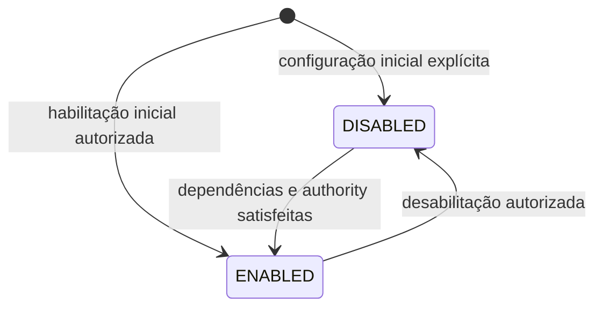

# Módulos e features por condomínio

`Module` e `Feature` são conceitos de catálogo/capacidade. `CondominiumModule` e `CondominiumFeature` exprimem disponibilidade configurada para um único tenant. A disponibilidade não equivale a autorização.

## Estado

Para cada associação tenant-feature/módulo, estados mínimos propostos: `ENABLED` e `DISABLED`. `AVAILABLE` descreve condição do catálogo global, não estado do tenant. `PENDING` não é adotado sem fluxo de aprovação. Estado padrão inicial permanece por decidir; não presumir todos habilitados nem desabilitados.

O diagrama enumera apenas as transições conceituais; ele não prescreve criação de associação, mecanismo de catálogo ou automação.

## Transições e guardas

| Transição | Ator / Permission / Scope | Pré-condições e efeitos |
|---|---|---|
| Configurar → `ENABLED` ou `DISABLED` | Ator com `module.enable/disable` ou `feature.enable/disable`, scope Platform para catálogo global ou condomínio/feature correspondente para habilitação local | Tenant explícito, capability conhecida, autoridade aplicável e dependências declaradas satisfeitas. A matriz é proposta. Auditar estado anterior/novo, ator e tenant. |
| `DISABLED` → `ENABLED` | Mesmo grant específico | Rever configuração/dependências atuais e autoridade; disponibilidade muda somente naquele Condominium. Não recriar dados históricos nem conceder grants de usuário. |
| `ENABLED` → `DISABLED` | Mesmo grant específico | Aplicar regra aprovada a operações dependentes em curso; impedir novas operações que exijam a capability segundo policy. Preservar registros, evidências, vínculos e auditoria. Notificar afetados se configurado. |

`Module` pode agrupar `Feature`s, mas não se assume que cada módulo seja entidade operacional independente. Dependência declarada só pode bloquear habilitação ou orientar a validação quando aprovada. Desativar uma feature não desativa implicitamente dependências/dependentes, não revoga `RoleAssignment` e não remove `Permission`.

## Transições proibidas, terminais e reabertura

- Habilitar em Condominium A não altera B.
- Habilitar não concede Role, Permission ou Scope.
- Operação que depende de feature desabilitada não inicia, salvo exceção aprovada.
- Desabilitar não apaga ou invalida fatos históricos.
- Não mudar de `ENABLED` para `DISABLED` silenciosamente como efeito colateral de plano, falha ou dependência não declarada.
- `DISABLED` é terminal apenas para a disponibilidade atual; pode voltar a `ENABLED` por ação explícita autorizada.
- Operações já iniciadas não são concluídas, canceladas ou revertidas automaticamente por alteração de disponibilidade. Tratar conforme OD-11.

## Eventos, notificações e auditoria

Habilitação/desabilitação são fatos auditáveis com actor, instante, tenant, capability, configuração anterior/nova e dependências identificadas. Notificações são opcionais; sua entrega não é pré-condição de habilitação. Estado do módulo não representa lifecycle financeiro, reserva ou operação que dependa dele.

## OPEN DECISIONS

- **OD-11:** authority, defaults, dependências, incompatibilidades, comportamento de operações em curso, leitura histórica após desabilitação, reativação.
- **OD-17:** permissions necessárias a cada feature e qualquer capacidade de leitura decorrente da habilitação.
