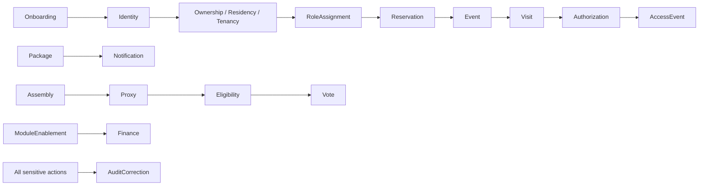

# Auditoria, correções e cenários transversais

## WF-25 — Auditar e corrigir workflow/fato

### Objetivo

Preservar atribuição, contexto, resultado e histórico em ações sensíveis e corrigir erros sem apagar silenciosamente o fato anterior.

### Participantes

Ator que realizou ação; revisor/corretor com permission específica; responsáveis de governança. Leitura de AuditLog exige scope e finalidade próprios.

### Contexto/Tenant

AuditLog fica no contexto Platform ou tenant do recurso; correção usa tenant e recurso originais e não muda tenant como efeito colateral.

### Gatilho e pré-condições

Operação sensível ou identificação de dado/fato incorreto. Revisor possui `audit_log.read` se consultar trilha e permission de correção para recurso específico.

### Permissões necessárias

Permissions de ação original mais `audit_log.read` e, conforme domínio, `access_event.correct`, `package.correct`, `vote.correct/cancel`, `reservation.update/cancel`, `person.update`, `role_assignment.*`. Cada capability é distinta; não existe permission genérica “correct everything”.

### Dados/conceitos envolvidos

`AuditLog`, Domain Event, Operational Event (`AccessEvent`, `PackageEvent`), recurso corrigido, referência original, autor/motivo, tenant, resultado.

### Fluxo principal

1. A ação original registra actor, ação, resource, timestamp, tenant/scope, resultado e contexto relevante.
2. Solicitante apresenta referência e motivo de correção.
3. Valida-se permission de correção, authority independente quando exigida, tenant e estado atual.
4. Correção registra fato corretivo vinculado ao original; não apaga/regrava o evento original silenciosamente.
5. Atualização do estado atual ocorre só segundo regra do domínio; outros workflows/notificações não são reexecutados por inferência.
6. Affected party é notificada somente quando regra/privacy definir.

### Fluxos alternativos e validações

Sem permission, conflito legal, voto secreto ou dado sujeito a retenção: negar/encaminhar revisão. Erro na auditoria deve ser tratado como falha explícita de processo; não declarar sucesso sem trilha quando trilha é requisito.

### Transições, eventos, notificações

Correction requested/approved/rejected e corrective fact são distintos do fato original. Notification posterior requer gatilho e policy explícitos.

### Auditoria

Auditar tentativa, autorização, correção, decisor, motivo, referência original, novos dados minimizados e resultado. Auditoria de leitura também é restrita.

### Pós-condições/término

Fato original e correção rastreáveis; estado atual coerente com regra ou correção pendente; nenhum histórico perdido.

### Erros/negações

Permission/scope ausente; recurso/tenant incorreto; transição irreversível sem regra; tentativa de apagar evento; destinatário sem finalidade de visibilidade.

### OPEN DECISIONS

OD-07 e domínios pertinentes: retenção, correção versus nova versão, authority de revisor, acesso a trilha, notificações e tratamento de dados sensíveis.

---

## WF-26 — Tentativa de ação no tenant incorreto

### Objetivo

Demonstrar negação segura de operação cross-tenant e ausência de vazamento de informação.

### Participantes

Sujeito autenticado; responsável de auditoria apenas se autorizado. Ator pode ser a mesma Person com role no tenant A tentando acessar B.

### Contexto/Tenant

O request seleciona tenant/contexto A, mas recurso alvo pertence a B, ou o sujeito não possui assignment em B.

### Gatilho e pré-condições

Leitura, alteração ou operação sobre recurso cujo tenant diverge do tenant autorizado.

### Permissões necessárias

Assignment/permission no tenant A não serve ao recurso B. `platform.cross_tenant.access` não é presumido; mesmo quando existe, precisa de propósito/resource permission e escopo específico.

### Dados/conceitos envolvidos

`Person`, `UserAccount`, `RoleAssignment`, `Permission`, `Scope`, Condominium A/B, resource, `AuditLog`.

### Fluxo principal

1. Comparar subject, scope/tenant do grant e tenant do resource.
2. Detectar incompatibilidade, assignment ausente ou contexto ambíguo.
3. Negar a operação sem revelar existência, campos ou estado do recurso alheio além do mínimo necessário para resposta de negação.
4. Registrar tentativa sensível conforme política de auditoria, sem copiar dados do tenant B para A.
5. Não tentar fallback global nem trocar implicitamente o condomínio.

### Fluxos alternativos/validações

Se ação estiver explicitamente autorizada cross-tenant para suporte, validar purpose e target tenant e limitar a dados/ação concedidos; acesso continua sujeito a audit e privacy. Se assignment/scope for ambíguo, negar e encaminhar revisão.

### Eventos/fatos/notificações

CrossTenantAccessDenied ou tentativa correspondente como registro de auditoria/segurança; não gerar evento de domínio do tenant B. Notificação de segurança a responsável somente segundo policy.

### Auditoria

Registrar subject/actor, tenant solicitado, recurso alvo em nível não revelador, permission/scope ausentes ou incompatíveis e resultado; leitura da trilha permanece restrita.

### Pós-condições/término

Nenhuma alteração ou dado B retornado à operação A; negação e auditoria conforme policy.

### Erros/negações

Qualquer tenant incompatível, recurso não autorizado, assignment de outro tenant, permission ausente, purpose ausente para cross-tenant ou ambiguidade resulta em negação.

### OPEN DECISIONS

OD-14/OD-15/OD-16 e OD-07: política de conflito, scope platform, suporte excepcional, dados reveláveis no erro, registro/alerta e break-glass.

---

## Idempotência e duplicidade no nível de negócio

Nenhum mecanismo técnico é definido. Regras candidatas e decisões:

| Operação repetida | Comportamento de negócio seguro | Decisão pendente |
|---|---|---|
| Receber/registrar o mesmo pacote de novo | Não declarar dois recebimentos físicos sem evidência; verificar repetição e preservar tentativa de correção. | Critério para distinguir nova encomenda e duplicata. |
| Confirmar Package duas vezes | Não criar CONFIRMED duplicado como se fossem duas confirmações; responder/registrar repetição conforme policy. | Repetição no-op versus negação e auditoria da tentativa. |
| Registrar PICKED_UP duas vezes | Não contar múltiplas retiradas sem evidência; manter conflito explícito. | Tratamento da segunda observação. |
| Registrar presença duas vezes | Não contabilizar duplicadamente uma pessoa/representação para mesma sessão sem regra de correção. | Critério de identidade e correção da presença. |
| Votar duas vezes na mesma pauta | Não assumir substituição de voto nem dupla contagem; bloquear decisão definitiva até regra eleitoral aprovada. | Se troca/retificação é permitida e trilha de voto. |
| Repetir notificação/entrega | Nova tentativa deve ser separada; não apagar falha anterior nem duplicar comunicação lógica sem policy. | Critério de deduplicação, retries e múltiplas notificações. |
| Repetir ENTRY/EXIT | Não fundir eventos só por proximidade temporal; cada observação requer evidência. | Critério de duplicidade e correção operacional. |
| Repetir ação de grant | Não criar permissões cumulativas ambíguas nem sobrescrever grant ativo. | Merge, rejeição ou renewal e auditoria. |

## Concorrência e conflitos

- Reserva para a mesma área/período: validar disponibilidade no instante conceitual da confirmação; impedir duas confirmações incompatíveis quando policy proíbe conflito. Ordem/prioridade em empate permanece OPEN DECISION.
- Grant/revoke concorrente: decisão precisa usar vigência/estado efetivo claramente definido; operação já autorizada versus revogada precisa de política de instante efetivo.
- Package confirmation/release concorrentes: impedir que estado apresentado esconda fatos incompatíveis; preservar ambos os atores/instantes para revisão.
- Votos concorrentes/duplicados: não aceitar contagem dupla; regra de substituição e janela exige validação legal.
- Alteração/cancelamento de Event/Reservation com authorization ativa: identificar referências afetadas e não revogar ou manter acesso silenciosamente; aplicar regra aprovada.
- Access events observados concorrentemente: preservar timestamps e autoria; não reconstruir sequência física sem regra/evidência.

Não se escolhe lock, transação, fila ou mecanismo de sincronização.

## Falha de notificação

Falha de Push, WhatsApp, e-mail ou in-app resulta em `NotificationDelivery.failed` quando evidenciada. Retry/fallback, se aprovados, geram tentativas separadas. Se todos falham, registra-se falha de comunicação e aplica-se procedimento operacional alternativo apenas se decidido. A falha não desfaz automaticamente reserva, recebimento de Package, autorização, presença ou outro workflow.

## Dependências

